# Report of Fakeddit Data Analysis

Ivan Polishchuk and Paweł Moćko

**CAUTION: it is a simplified version.**

## Introduction

### Motivation behind misinformation classification.

The problem of fake news dissemination is acute in modern society, directly threatening citizens' trust in institutions and provoking irrational panic during critical moments such as medical epidemics. People of today frequently access

Combating this threat requires reliable machine learning algorithms, yet their development is seriously hindered by a shortage of high-quality data. Most traditional datasets, such as LIAR or Some-Like-It-Hoax, have very substantial limitations that make them largely unsuitable for comprehensive analysis. As a rule, they are too small in volume, restricted exclusively to text format and binary classification logic (where a news item can only be true or false), and focused on very narrow subject areas, such as American politics, which prevents models from learning from diverse everyday content.

### Fakeddit dataset

The uniqueness of the Fakeddit dataset lies in its multimodality, which allows algorithms to rely not only on isolated text but also on the visual context of images, significantly enriching the amount of information that can be used for the detection of misinformation. The data consists of post titles, images associated with them and additional metadata such as creation time, number of comments, subreddit name, etc.
The overall quality of the data was quite good, no further pre-processing was required over the one provided by the dataset authors.

The dataset consists of over 1 million posts, of which around 682k have an image associated with them. The posts come from across 22 subreddits.
During data collection there were also additional quality assurance steps:

- removing all posts with score < 1,
- subreddit-specific title tags were removed.

### Post labels

For each sample there are three different labels assigned, corresponding to different levels of granuality:

- 2-way labels: a `True/False` split - represents whether or not the posts presents factual information
  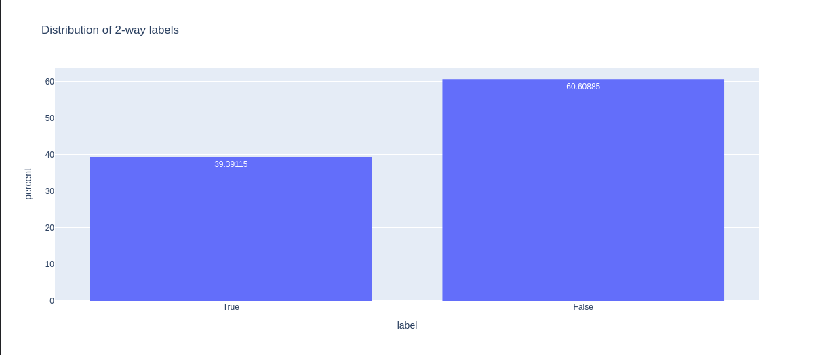
- 3-way labels: posts containing false data have been split into two categories:
  - false text, false sample - sample has `False` label in 2-way labeling and contains untrue information
  - true text, fale sample - sample has been deemed `False`, but contains "true" text - it involves only posts containing propaganda posters.
    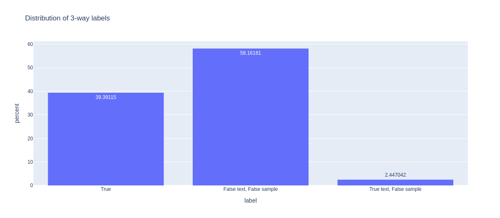
- 6-way labels: `True` label remains the same as in the other two kinds of labeling, the `False` label has been split into:
  - imposter content; i.e. content auto-generated by bots
  - misleading content: content conveyed in a manipulated way to mislead people in believing false narratives
  - satire / parody
  - false connection: submission images in this category do not accurately support their text descriptions
  - manipulated content: content that has been manually altered e.g. via image modifications
    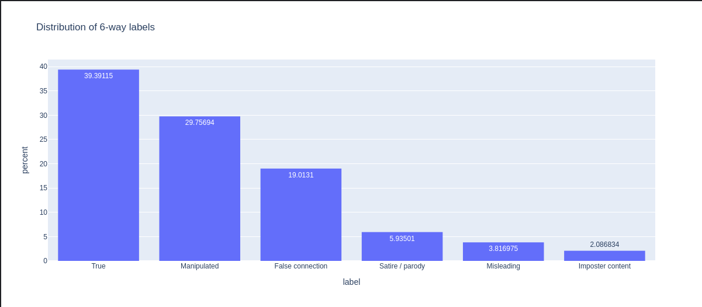

### The labeling process

In context of Fakeddit dataset it is very important to point out how the labels were assigned. For each subreddit the authors of the dataset chose they've inspected 10 random samples. If the 6-way label they assigned for each of the sample matched - then the subreddit was kept in the dataset and the label was assigned to each post in the subreddit.
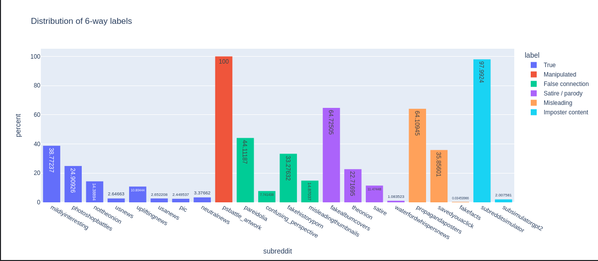

This labeling process makes it so that misinformation classification tasks devolves into task of predicting the subreddit from the title.
An interesting assignment is "manipulated" for `psbattle_artwork` subreddit - since it consists of posts that rely on image manipulation - albeit it's use seems rather satirical.

### Examples


Above is a picture of a cat titled "he looks huge". This post comes from `confusing_perspective` subreddit - thus it's labeled as false connection.


The above post is titled "Obligatory godzilla post" and comes from `psbattle_artwork` subreddit.

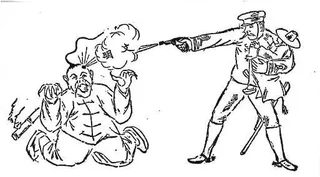

Cleaned title: "newspaper illustration depicting japan shooting china with the bullet of civilization first sinojapanese war"

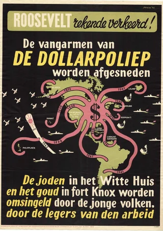

Another propaganda poster "roosevelt figured wrong the tentacles of the dollaroctopus will be cut the jews in the white house and the gold in fort knox have been surrounded by young people by the armies of labor nsb poster from the netherlands"

### Temporal resolution

The dataset contains data from quite large date range. The first posts come from 2008, while the last ones from 2019.

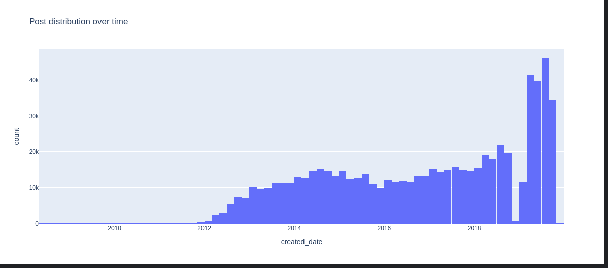

### Splitting the data

For the purpose of the training we have split the data using 60/20/20 stratified split. The usage of temporal split also seemed justified initially, but the labeling strategy used by the dataset author makes it so that time is not main source of bias. For example: post in the `usnews` subreddit are automatically assigned as truthful, regardless of the date.

### Provided metadata

The dataset provides also information on:

- author (almost 35k different values!)
- scores (upvotes - downvotes)
- upvote ratio
- number of comments
- etc

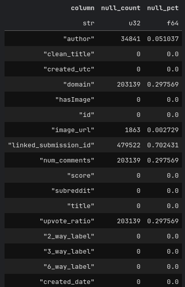

In there were some null values. There was no choice of clearning strategy since we did not use them for the training.
Utilizing these could be a future direction.

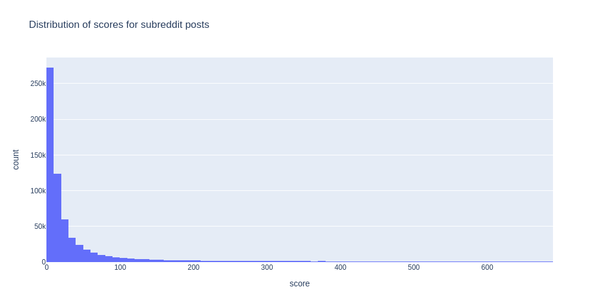

Using metadata is also tricky, for example authors mostly appear once or twice, although there are some clear outlines - which could bring some signal.
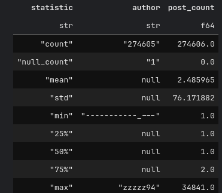

## Text-only models

For our initial experiments we have only used one column of the dataset `clean_title`. It consists of cleaned post titles as described previously.

### Baseline model

We have started by a simple model using combination of `Tf-Idf` embdedings and a logistic regression model. It is based on uni and bigrams.

#### Binary case

First we've wanted to see performance on 2-way labels to gain better intuition on how the preditions are made:

Test set results:
ROC AUC (Binary): 0.9085

              precision    recall  f1-score   support

    True (0)     0.7579    0.8396    0.7967     53553
    Fake (1)     0.8878    0.8255    0.8555     82317

    accuracy                         0.8311    135870

| rank | True     | Fake              |
| ---- | -------- | ----------------- |
| 1    | says     | cutouts           |
| 2    | in       | circa             |
| 3    | police   | other discussions |
| 4    | donates  | discussions       |
| 5    | sign     | mrw               |
| 6    | lets you | colourized        |
| 7    | saves    | til               |
| 8    | way the  | florida man       |
| 9    | tells    | colorised         |
| 10   | these    | poster            |


We see that model is biased towards the most common label (False).

We get an interesting overview by the ranking of words that are the most impactful for the predictions.

To get more context we took a look at the most common words for each subreddit then:

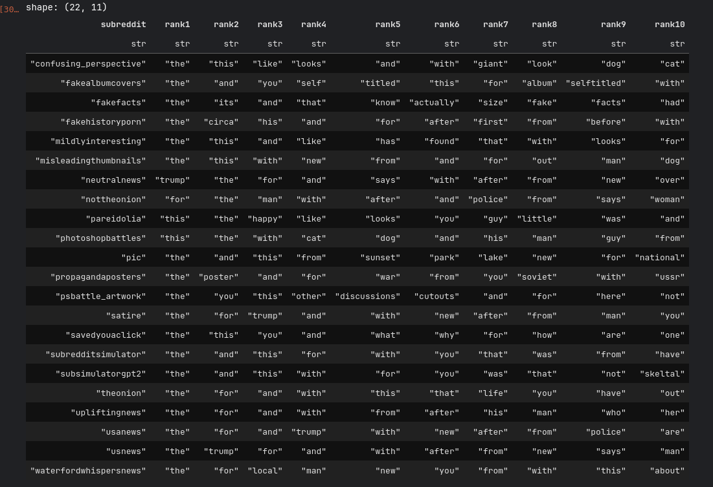

Especially for the fake case we may see:

- `circa`, `colourized`, `colorised` - words that are most probably associated with `fakehistoryporn` subreddit
- `other`, `discussions` - words that are common in `psbattle_artwork` subreddit

Hence we may deduce that terms frequency provides information about the subreddit which contributes an indirect data leakage. Although the Tf

#### 6-way case

Afterwards we trained the same combination of Tf-Idf embeddings and logistic regression for the 6-way case.
In that case Optuna has also been used for hyperparameter optimization for 20 trials.

| Confusion Matrix                     | Optuna training history                  |
| ------------------------------------ | ---------------------------------------- |
| 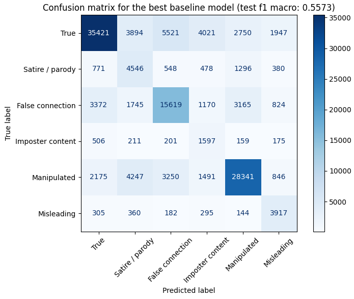 | 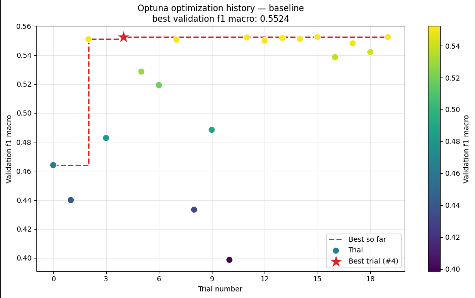 |

And the word rankings:
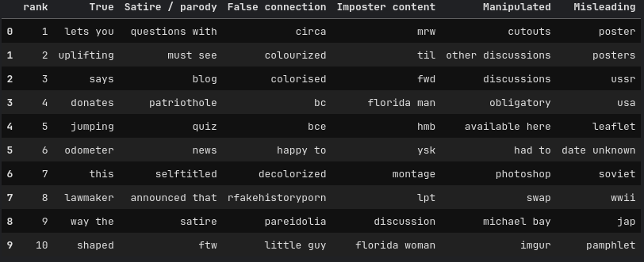
Here we have another finding; in the `misleading` category containing `propagandaposters` subreddit, "poster", "posters" and "ussr" are the words that influence the prediction the most.

### Semantic Embeddings

Afterwards we have tried to use more general embeddings from `sentence_transformers` library. We have used two text embedding models:

- `paraphrase-MiniLM-L3-v2`
- `all-MiniLM-L12-v2`
  both based on transformer architecture.
  Their choice was based on the benchmark on `sentence_transformers` documentation.
  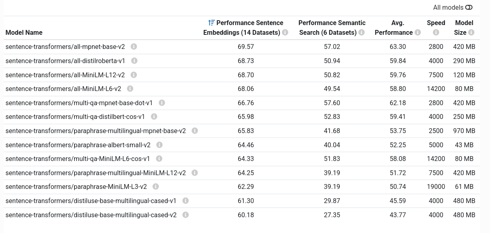

The choice was based on speed/performance trade-off.
We've additionally decided to compare `LogisticRegression` classification head with the `LightGBM` based one.
Afterwards we've conducted 4 additional training runs with `optuna`. Both 20 trial long.

The overall training pipeline looked as follows:

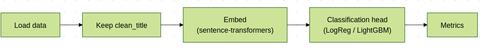

Below are confusion matrices for each of the approaches:

| paraphrase-MiniLM + LR                      | all-MiniLM + LR                                          |
| ------------------------------------------- | -------------------------------------------------------- |
| 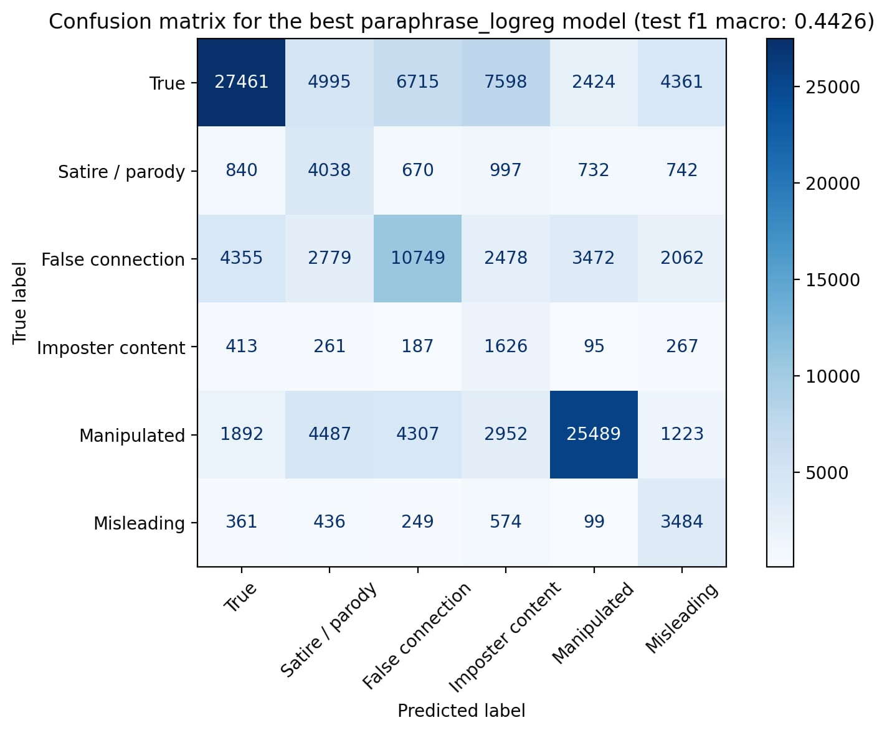     |  |
| paraphrase-MiniLM + LightGBM                | all-MiniLM + LightGBM                                    |
| 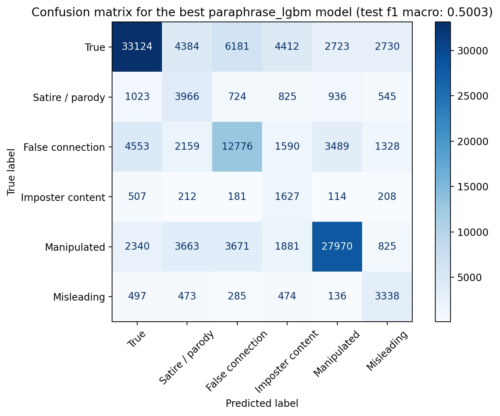      | 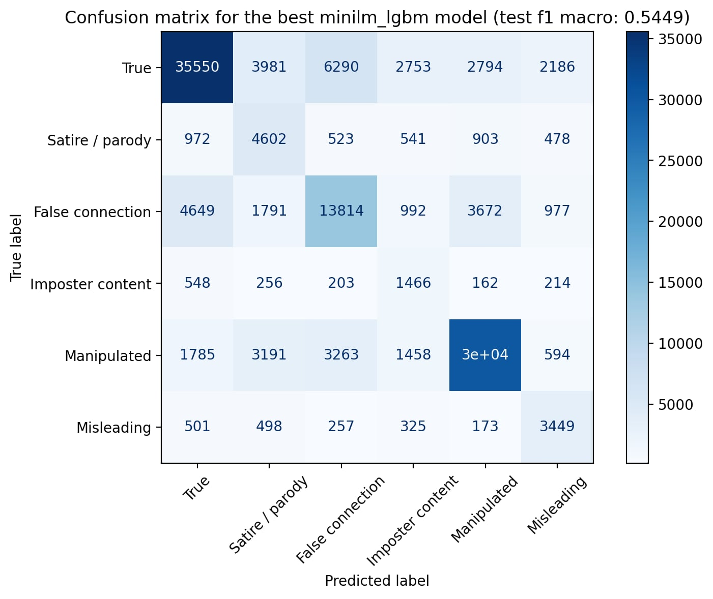                 |
| paraphrase-MiniLM + RF                      | all-MiniLM + RF                                          |
|  | 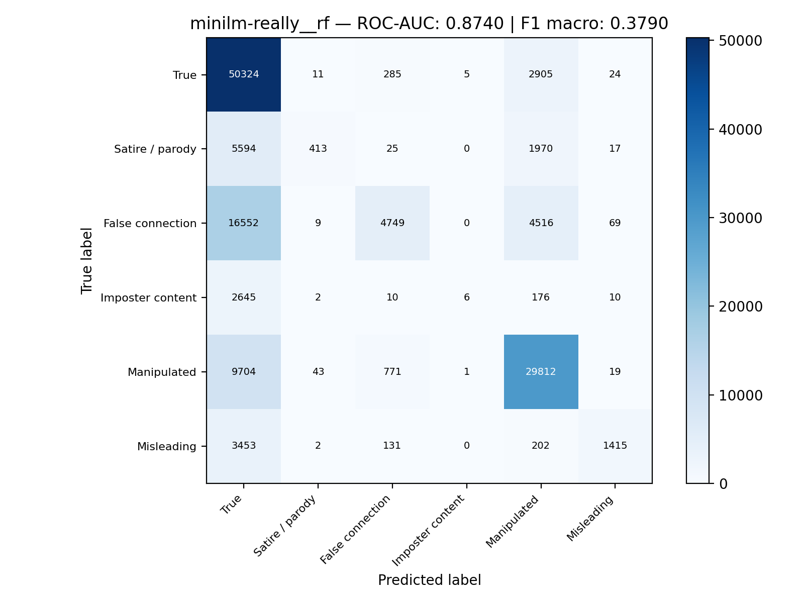           |

And the optuna training history (val f1 / trial graph)

| paraphrase-MiniLM + LR                      | all-MiniLM + LR                                        |
| ------------------------------------------- | ------------------------------------------------------ |
| 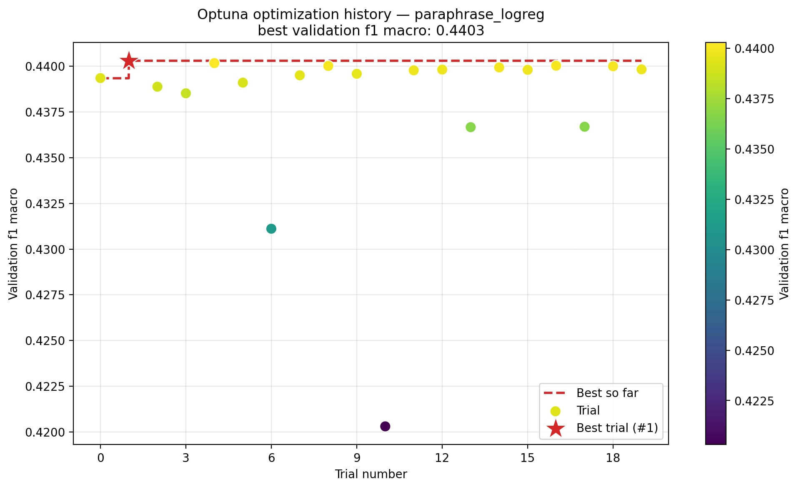 |  |
| paraphrase-MiniLM + LightGBM                | all-MiniLM + LightGBM                                  |
| 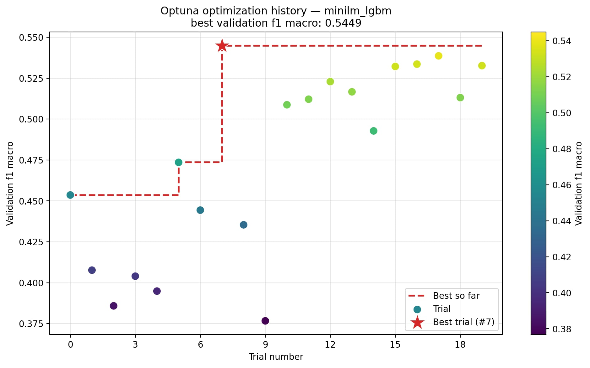   |               |

| name              | accuracy  | macro precision | macro recall | macro f1  |
| ----------------- | --------- | --------------- | ------------ | --------- |
| baseline          | **0.658** | 0.534           | **0.641**    | **0.558** |
| paraphrase_logreg | 0.536     | 0.444           | 0.551        | 0.443     |
| paraphrase_lgbm   | 0.609     | **0.585**       | 0.585        | 0.500     |
| minilm_logreg     | 0.582     | 0.469           | 0.579        | 0.479     |
| minilm_lgbm       | **0.655** | 0.520           | 0.616        | 0.545     |
| paraphrase_rf     | 0.617     | **0.700**       | 0.343        | 0.337     |
| minilm_rf         | 0.638     | **0.731**       | 0.364        | 0.379     |

The results we got using semantic embeddiings were actually worse than in the case of the baseline (in terms of Macro F1 score). Nonetheless we believe they could generalize better since they do not suffer from the same data leakage problem.

## Using Vision-Language Models

The pipeline for this approach consisted of two stages: data fetching and model training.

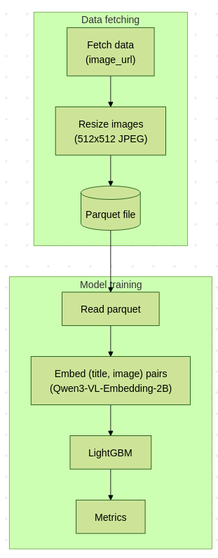

````

### Gathering images

Along the original dataset over 110GB of image data was shared by the authors.
This made it inpractical to work with in the cloud computing environments we depended on (kaggle and google colab).

Thus we've decided go along with fetching the images off of the internet by ourselves. We have used `image_url` column located for the each sample.

There were two great hinderences we've encountered:
- some images were no longer available
- rate limiting

nonetheless we've accepted that limitation and went further.
To save on storage space we've been continuously writing to a parquet file data in shape
```python
{
    id: str,
    image: bytes,
    clean_title: str,
    split: str,
    6_way_label: int,
}
````

where images were resized to 512x512 and stored as binary representation of a jpeg file.
This has saved us tons of storage. A file containing over 260k images took around 9.7GB of storage.

Evnetually storing all the images in this format would be a feasible future direction of the project.

### VLM-based model

To make use of visual data we have used `Qwen3-VL-Embedding-2B` model to extract embeddings off of both modalities.

```python
def embed_batch(clean_titles: list[str], image_bytes_list: list[bytes]) -> np.ndarray:
    """Returns float32 array of shape [batch_size, 2048]."""
    inputs = [
        {"text": title or "", "image": Image.open(BytesIO(img)).convert("RGB")}
        for title, img in zip(clean_titles, image_bytes_list)
    ]
    return model.encode(inputs, convert_to_numpy=True, batch_size=len(inputs))
```

These embeddings were then fed into LightGBM classification head. We've went with LightGBM as it seemed to score much better than logistic regression-based methods from the previous trials.

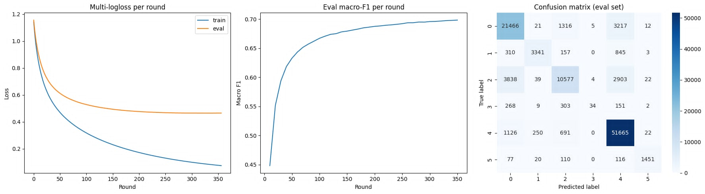

On the reduced dataset with `(image, clean_title)` pairs we have achieved:

- accuracy: 0.816
- macro F1: 0.764
- macro precision: 0.815
- macro recall: 0.739

which is much better result than for any of the previous approaches. Visual data in fact did help.

## Summary & Future Directions

We have tested machine learning of increasing complexity to tackle the task of multimodal misinformation classification. We have stumbled open probles related to the data collection process itself, but we have succesfully indendified them and thought about how they relate to our findings.
Additionally we had our own share of technical challenges with regards to fetching lots of images from the internet, which we had adressed by using recommended techniques of handling large data volumes. Finally we have proven the superiority of using multiple modalities over sticking to text only.

Next steps that could be taken are:

1. Extend parquet dataset to contain all the images
2. Try different classification heads.
3. Use metadata such as scores, author names.
