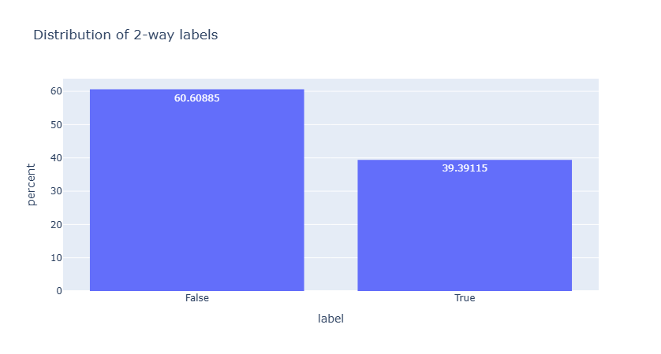
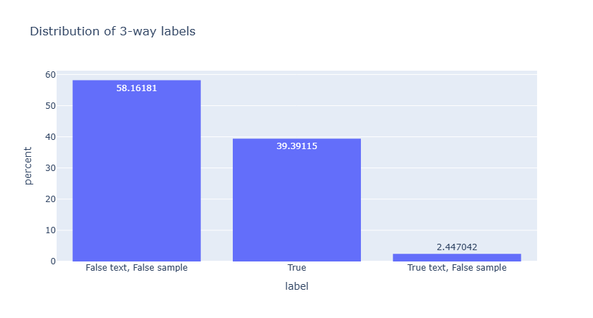
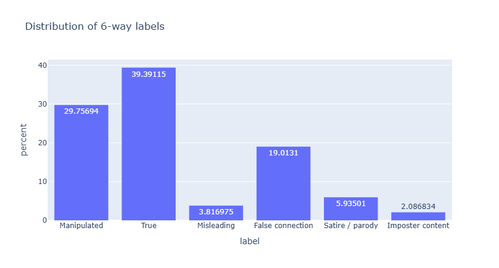
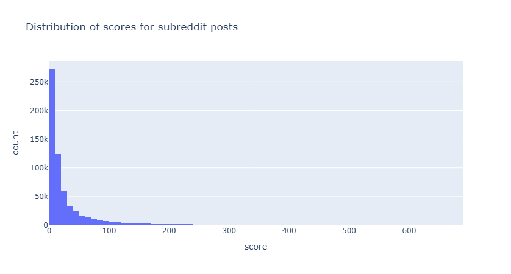
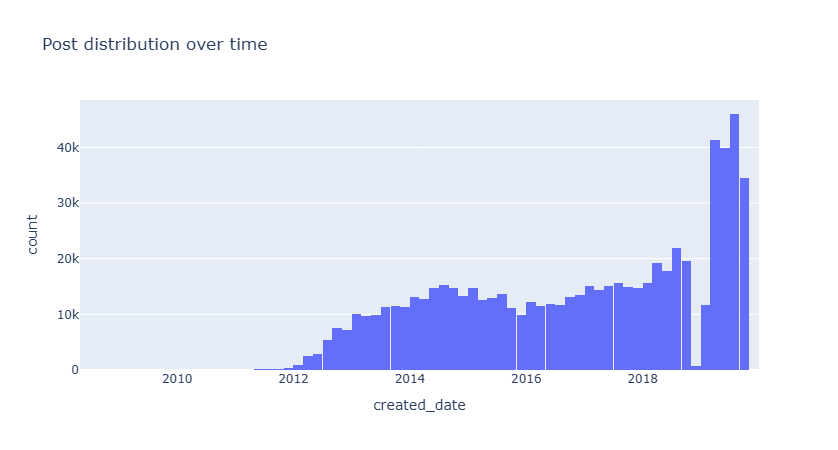
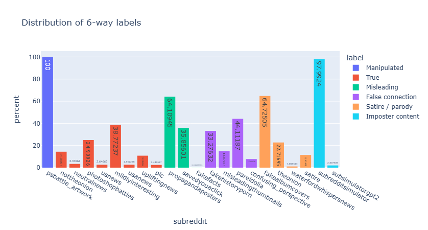
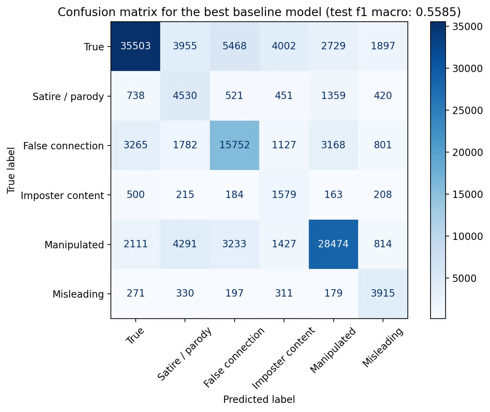
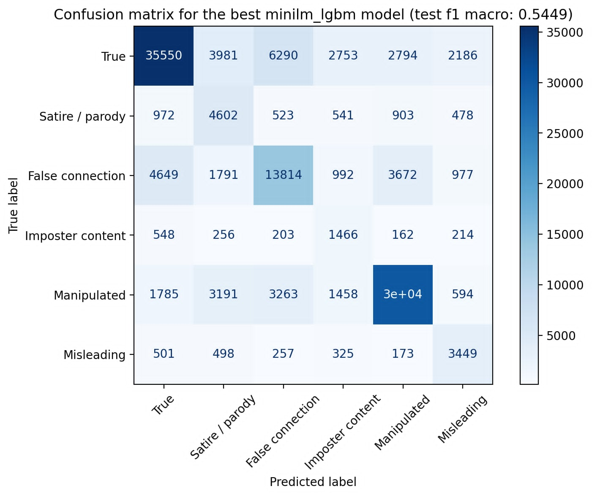
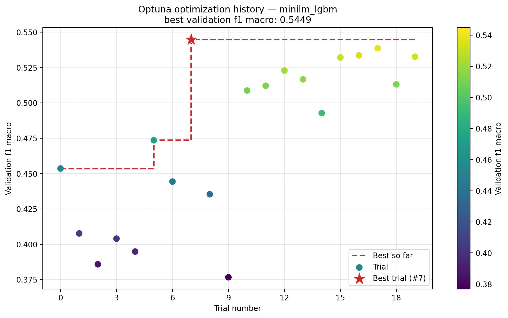

## Introduction and therotical fundamentals

<!-- The problem of fake news dissemination is acute in modern society, directly threatening citizens' trust in institutions and provoking irrational panic during critical moments such as medical epidemics. Combating this threat requires reliable machine learning algorithms, yet their development is seriously hindered by a shortage of high-quality data. Most traditional datasets, such as LIAR or Some-Like-It-Hoax, have very substantial limitations that make them largely unsuitable for comprehensive analysis. As a rule, they are too small in volume, restricted exclusively to text format and binary classification logic (where a news item can only be true or false), and focused on very narrow subject areas, such as American politics, which prevents models from learning from diverse everyday content. The uniqueness of the Fakeddit dataset lies in its multimodality, which allows algorithms to rely not only on isolated text but also on the visual context of images, significantly enriching the feature space for detecting fakes. The presence of text-image pairs opens up enormous prospects for implicit fact-checking tasks, where one modality serves as an evidence base for verifying the other. An algorithm can use the visual details of a photograph as strict proof of the truthfulness or falsity of a written headline, and conversely, analyse the text to confirm the authenticity of the attached picture, thereby identifying subtle discrepancies between the stated meaning and the actual visual content. -->

Fakeddit represents an unprecedentedly large dataset, containing more than one million (1,063,106) unique samples of news and posts collected from the Reddit platform via the pushshift.io API. This dataset covers almost a decade, starting from 2008, which allows machine learning algorithms not only to capture short-term trends but also to adapt deeply to the evolution of cultural-linguistic patterns and changes in the news agenda. More than 300,000 unique users from 22 different thematic communities (subreddits) contributed to the formation of the database, ensuring an incredible diversity of perspectives, writing styles, and topics covered — from political analysis to everyday observations. The authors meticulously extracted not only the headlines and attached images but also rich metadata, including scores, author names, and audience comments. Moreover, about 64% of the entire final dataset consists of fully multimodal samples containing both textual and graphical components. The high quality and reliability of the collected dataset were ensured through a strict multi-level filtering system that completely eliminated the need to manually sort each of the million items. At the first stage, primary cleaning occurred naturally through the moderators of the subreddits themselves, who promptly remove any posts that violate platform rules or do not fit the community's theme. At the second stage, the authors harnessed the collective intelligence of Reddit’s thousands of users, excluding from the dataset absolutely all posts with a user rating below one, reasonably assuming that such low scores reliably mark irrelevant or outright low-quality content. Finally, for final confirmation of the reliability of the selected sources, the researchers conducted a control manual check, randomly examining ten posts from each community. They excluded those sources whose content deviated from the stated topic, leaving only the 22 cleanest and most relevant subreddits for the final database.

Labeling the vast amount of data was performed using the distant supervision method — an approach that involves automatically assigning labels to all posts based on the known general theme of the subreddit from which they were extracted. This eliminates the need to manually label each individual post. Depending on the task, the dataset supports three levels of classification nesting: binary (basic division into truth and fake), ternary (where fakes are further divided into completely false and those where the text itself is truthful, such as direct quotations from propaganda posters), and the deepest six-level classification. This detailed classification presents six labels. The True label covers reliable content that fully corresponds to actual facts. Satire/Parody includes posts that present truthful current information in a satirical or parodic manner, which formally makes them false in a literal reading. Misleading Content describes information that has been intentionally distorted to manipulate and deceive the audience. False Connection marks cases where the attached image completely does not match the textual description, creating a false visual context. Manipulated Content refers to artificially fabricated or edited photographs. The sixth label is Imposter Content — content generated by specially trained bots that plausibly mimic the behaviour of real people on the platform in order to intentionally sow chaos in the information environment and confuse algorithms. It should be noted that some of these categories, in particular Manipulated Content, consist almost entirely of visually altered pictures, so when creating narrowly focused models that analyse only textual data, it is advisable to disregard such labels so as not to introduce unnecessary mathematical noise into the training sample.

During extensive experiments aimed at testing the effectiveness of the collected data, the dataset authors preliminarily filtered out all incomplete samples lacking text or images to ensure the purity of comparison across different modalities. To extract deep semantic features from texts, the researchers used the InferSent model, which has proven itself as a generator of universal sentence embeddings, as well as the advanced BERT architecture, which shows outstanding results in natural language understanding. For parallel processing of visual information, powerful computer vision neural networks such as VGG16, ResNet50, and the more modern EfficientNet were employed. The training process for hybrid models was based on the use of dense layers, where the extracted vectors of text and images were combined using various mathematical methods — addition, concatenation, maximum computation, and averaging — after which the resulting tensor was passed to a final softmax classifier. The results of these comprehensive tests unequivocally demonstrated the superiority of the multimodal approach: algorithms that analysed text and images together consistently outperformed models trained on only one modality. The absolute winner among all configurations was the combination of the BERT text embedder and the ResNet50 visual network, combined via the maximum computation method, confirming the critical importance of merging contexts for fake news recognition. In-depth error analysis conducted by the researchers revealed a number of very interesting patterns and vulnerabilities of modern classification algorithms. It turned out that the most difficult category for baseline networks to recognise was Imposter Content. This is quite logical: the modern generative algorithms underlying such bots so skilfully mimic human speech and communication style that they create hyper-realistic texts, almost indistinguishable from posts by real users. The second most difficult category for the models was Satire/Parody, because the creators of satirical posts deliberately and very accurately copy the formal style of real mass media. For an algorithm to successfully detect satire, it is not enough to simply analyse syntax or word sentiment — it requires deep contextual knowledge of how the real world works, which baseline models do not yet possess to a sufficient degree. At the same time, the authors were pleasantly surprised by the fact that the final multimodal neural network was able to handle the Manipulated Content category almost flawlessly, easily detecting traces of editing and photoshopping in images. Furthermore, the analysis showed that in ambiguous situations, the model often tended to erroneously assign the True label simply because in the detailed classification this category remains the most numerous, creating a natural class imbalance in the training sample.
(2-3 предложения сути)

Within our project, the analysis of the labeled Fakeddit dataset, where each post is initially assigned one of six verifiable labels (from pure truth to satire and imposter content), represents a classic supervised machine learning task. Our goal is to build a mathematical model that can uncover hidden patterns in the provided features and learn to predict the category for new, unseen posts independently. From a theoretical perspective, classification is a process of finding an optimal separating hyperplane (or a set of complex non-linear boundaries) in a multidimensional feature space. The algorithm analyzes the coordinates of each object in this space and computes the probabilities of its belonging to each possible class. Since our task involves distributing objects across six categories at once, we employ multiclass classification strategies. Depending on the chosen algorithm, this problem is solved either by constructing several binary classifiers, each mathematically separating one class from all the others (One‑vs‑Rest strategy), or natively, when the algorithm can directly estimate the probability distribution across all categories simultaneously. Before feeding the data to mathematical classification models, it is necessary to deeply understand their structure, which brings us to the stage of Exploratory Data Analysis (EDA). EDA is a fundamental analytical process in which the researcher uses descriptive statistics and visualization methods to uncover hidden patterns, class imbalance, and structural anomalies. In classic Data Science practice, primary analysis relies on studying the distribution of the target variable, analyzing text lengths, and searching for statistical outliers, since a strong class imbalance will bias the model’s predictions toward the dominant class. An integral part of this stage is data cleaning, which is critically important for preventing so‑called data leakage. Data leakage occurs when information from the test set accidentally overlaps with the training set through duplicate posts. This leads to the model not learning to generalize features but merely memorising specific examples, yielding illusorily high metrics during testing while failing completely in real‑world conditions. The theory of data cleaning relies on applying strict patterns: first, exact deduplication is performed on key fields such as the headline text and the image link. Special attention during cleaning is paid to handling missing values. Practice shows that attempts to fill missing text fragments or metadata with synthetic values often distort the semantic meaning of the post. Therefore, the most reliable pattern is to completely remove rows with missing critical information, thereby preserving the mathematical and semantic purity of the training sample for subsequent stages.

To objectively evaluate the power of complex modern algorithms, it is common practice in machine learning to first construct a baseline – a basic, mathematically transparent and computationally lightweight model. The baseline serves as a reference point: if a heavy neural network cannot significantly exceed this baseline metric, its use is considered impractical. In our project, the foundation of the baseline is a combination of the TF‑IDF vectorization method and logistic regression. Since algorithms cannot read text directly, the Term Frequency – Inverse Document Frequency (TF‑IDF) method converts words into numbers. The theoretical essence of this method is the creation of a sparse matrix where each unique word gets its own coordinate axis. The method counts the frequency of a term in a specific text but strictly penalises words that occur too often across the entire document corpus (e.g., conjunctions or prepositions), thus mathematically highlighting truly unique and meaningful terms. The resulting numerical vectors are passed to logistic regression – a linear classifier that computes a weighted sum of all object features and passes it through a special logistic function (sigmoid). This function compresses the result into a range from zero to one, which is interpreted as the probability of a post being fake. Logistic regression is ideal for a baseline due to its outstanding interpretability: we can directly extract the model’s weight coefficients to literally see which words the algorithm considers markers of false news.

Linear models such as logistic regression are often unable to capture complex non‑linear dependencies in texts; therefore, to improve accuracy, we turn to the theory of ensemble learning, applying Random Forest and LightGBM algorithms. The essence of ensembles is to combine many weak algorithms (decision trees) into a single powerful predictive system. Random Forest is based on the theoretical concept of bagging: it builds hundreds of independent deep trees in parallel, training each on a random subsample of data using a random subset of features. This artificial injection of randomness radically reduces the model’s variance and protects it from overfitting to noise. In turn, the LightGBM algorithm belongs to the family of gradient boosting. To understand boosting, one must examine in detail the theory of gradient descent – a classical optimisation method. The gradient of any function in a multidimensional space always points in the direction of its steepest ascent. Since our fundamental goal in machine learning is to minimise the loss function (i.e., to reduce prediction error to an absolute minimum), it is mathematically logical to take a step in the opposite direction, which is called the antigradient. Gradient boosting uses the same logic but applies it in function space: instead of updating weight coefficients, it sequentially adds new trees to the ensemble, each approximating the antigradient and compensating for the errors (residuals) of all previous trees. The specific feature of the LightGBM framework lies in its highly optimized architecture. First, it uses histogram‑based algorithms, which continuously discretise feature values into bins, dramatically reducing memory consumption and accelerating computations. Second, unlike traditional algorithms that grow trees symmetrically level‑by‑level (level‑wise), LightGBM employs a leaf‑wise strategy. This means that for splitting, it always selects only the tree leaf that promises the maximum mathematical reduction in error. Such asymmetric growth allows the algorithm to achieve high accuracy much faster, especially on large and complex datasets.

Despite its effectiveness, basic TF‑IDF vectorization has a critical theoretical flaw: it completely ignores word order and contextual meaning, treating the text merely as a bag of isolated terms. To enable the model to understand the real semantics of Reddit posts, we turn to the use of language embeddings based on the SentenceTransformers library. Embeddings are dense vectors of numbers in a multidimensional space where the geometric distance between vectors directly reflects the semantic similarity of texts. Thus, phrases with similar meanings, even if they share no common words, end up close to each other. The SentenceTransformers architecture is specifically designed on the basis of siamese neural networks to compress entire sentences into a single compact vector while preserving all the context contained within them. In our research, we apply lightweight models all‑MiniLM‑L12‑v2 and paraphrase‑MiniLM‑L3‑v2. The theoretical value of these models lies in the fact that they are products of knowledge distillation: they were trained to mimic the behaviour of giant neural networks but have significantly fewer parameters, making them incredibly fast in practice. The paraphrase‑family model deserves special attention because it was deliberately trained on paraphrasing databases, making it an ideal tool for our project: it can recognise hidden manipulation even if the authors of a fake news story try to rewrite a known false narrative with new words.

Having obtained high‑quality semantic features, we must ensure that the classifiers themselves operate at the peak of their capabilities. For this, we apply the Optuna framework; however, to understand its operation, a strict theoretical distinction must be drawn between model parameters and hyperparameters. Parameters (e.g., the weight coefficients of specific words in logistic regression or decision thresholds in LightGBM nodes) are internal values that the algorithm computes and updates by itself during the mathematical learning process. Hyperparameters, on the other hand, are high‑level architectural settings that the engineer sets before training and which define the rules of the game itself. Baseline models always use default hyperparameters created for abstract average tasks. By performing hyperparameter tuning, we adapt the model’s topology to the unique geometry and complexity of our specific news dataset, thereby extracting the maximum quality metric from the algorithm. In our code, for the baseline model we optimise the TF‑IDF settings: the hyperparameters max_df (controlling the removal of corpus noise and stop words) and min_df (responsible for ignoring rare random typos), as well as the regularisation hyperparameter C in logistic regression, which keeps weights from growing excessively and protects the algorithm from overfitting. For the advanced LightGBM, we tune the complex forest structure: the number of trees (n_estimators), the learning rate, as well as the depth and number of leaves, which determine the trees’ ability to capture complex branching patterns in deception. The semantic embeddings themselves remain frozen (static) to achieve enormous computational savings. The uniqueness and superiority of Optuna over classical random search lie in its use of Bayesian optimisation based on the TPE (Tree‑structured Parzen Estimator) algorithm. Instead of blindly testing all possible combinations of settings, Optuna mathematically analyses the history of previous trials, builds a probabilistic model of how settings affect the final F1‑score, and purposefully selects for testing only those hyperparameter values that have the highest statistical chance of improving the result.

The final theoretical stage of our project is the transition from purely textual analysis to multimodal analysis, because a significant part of online manipulation relies on visual deception. Computer vision traditionally relied on convolutional neural networks (CNNs), which excelled at extracting object boundaries and textures but poorly understood the deep semantic context of what was happening in a photo. Today, Vision‑Language Models (VLMs) have come to the forefront – complex architectures capable of deeply integrating visual and textual perception. At the core of most modern VLMs lies the cross‑attention mechanism and the concept of Vision Transformers, which cut an image into a grid of small fragments called patches. These visual patches are converted into numbers and mathematically projected into the same hidden vector space as text tokens (words). Thanks to the attention layers, the neural network forces the text tokens to literally “look at” the visual patches, allowing the algorithm to compare the meaning of the written text with specific objects in the photograph. In our pipeline, we use the modern giant model Qwen2.5‑VL‑7B‑Instruct, which contains 7 billion parameters. For feature extraction, we put this LLM into inference mode, feeding it both an image and the post’s headline simultaneously. Passing through the transformer layers, this information is transformed into deep internal hidden states. We programmatically extract the very last layer of these states, apply an attention mask to filter out padding tokens, and then average the values via a mean pooling operation. The output is a single, mathematically enriched vector embedding that contains the fused meaning of the text and the image. The theoretical value of such an approach is enormous: it is precisely this fused vector that enables the final classifier to detect the most difficult category, False Connection, where the text itself may be completely truthful, the original photograph genuine, but their deliberate combination creates a fake, misleading news story.

## Pipeline & Workflow

To formalise our project, we need to describe the structure and order of data manipulations. The creators of the original Fakeddit dataset were extremely concise in their assessments. Their publication contains almost no detailed steps, hidden engineering details, or conventions for handling intermediate results. The final metrics are presented rather sparingly, which complicates direct analysis. Our project offers an alternative approach. It is not merely a technical replication but an attempt to deepen and conceptually rethink the conclusions of the benchmark authors. The main business task is to independently verify the results obtained by the authors, not simply to compare dry numbers. We strive to build alternative methods for constructing classifiers and to see whether these new, more modern approaches can surpass the original or provide serious competition in real world conditions.

The implementation of our plan differs qualitatively from that proposed by the original authors due to strict objective constraints. The main challenge was the colossal size of the image database, exceeding 100 gigabytes. Operating with such multimedia arrays on basic computing resources is technically extremely difficult. However, despite these obstacles, we deliberately decided to raise the complexity bar. We abandoned the initially considered simplified version of the dataset containing only 55,000 items and instead took a huge sample from the original dataset on the Kaggle platform, comprising about 700,000 records. An important consequence of this ambitious decision became a key feature of our pipeline: the vast majority of analytical work is carried out exclusively on textual data. Adding visual content became the absolute pinnacle and the final stage of our project, for which we had to programmatically form a separate representative but reduced subsample from the large dataset.

Given the stated business goals and constraints, we built a strict sequence of dataset analysis consisting of five evolving stages. Each subsequent step logically follows from the limitations and problems of the previous one. The first stage involves exploratory data analysis (EDA) and data cleaning. Without this step, any metrics would be distorted by information noise, so obtaining a clean base of 700,000 items became the foundation for all further actions. In the second stage, having clean data, we create baseline models based on TF‑IDF. The business always needs a starting point, the simplest and fastest algorithm against which all expensive and complex solutions will be compared. However, the baseline relies on primitive word counting and completely ignores the semantics of language. Understanding this conceptual limitation naturally leads to the third stage: testing advanced ensemble models in combination with modern language transformers. Here we use embedders to extract deep meaning from texts and feed these complex data to algorithms such as LightGBM. When we find the most successful combination of model and embedder, the next problem arises: the default algorithm settings do not allow extracting maximum efficiency. This makes the transition to the fourth stage inevitable, where the Optuna framework uses Bayesian optimisation to finely tune hyperparameters to the specific geometry of our news texts. Finally, even a perfectly tuned text model inevitably hits a quality ceiling, because many fakes in the dataset are built exclusively on visual deception. Recognising that text alone cannot describe a false image logically leads us to the fifth and final stage: creating a highly complex multimodal architecture using a modern Vision‑Language Model (Qwen), which finally closes the blind spots of the purely text‑based pipeline.

Each stage of our pipeline is driven by a set of specific hypotheses and general assumptions. First, we expect to achieve results close to those obtained in the original study, assuming that our overwhelming focus on textual data in the first four stages will not lead to a radical drop in metrics compared to the overall benchmark. Second, we test the hypothesis that alternative modern text transformers, in particular architectures of the paraphrase family, will be able to demonstrate significantly better results, even taking into account our computational constraints. We sincerely hope that the theoretical effectiveness of these complex tools will be unequivocally proven in practice, because otherwise the feasibility of their implementation in real business processes would be called into question. Finally, the original text leaves some ambiguity regarding how critical the presence of images is for the claimed fine‑grained classification. Recognising the specificity of the Fakeddit dataset, we assume the particular importance of visual content. Therefore, our final business hypothesis is that the image‑based classification model developed in the fifth stage will show a result at least comparable to the best purely text‑based model, and ideally surpass it, thus proving the absolute necessity of image analysis for fully detecting fake news.

## Eksploracja i czyszczenie - 1

The practical implementation of our pipeline begins with a fundamental step – loading and initially examining the raw data array. Data acquisition was carried out along two parallel tracks: loading directly into the Kaggle cloud environment to ensure access to the necessary computing resources at later stages, as well as local deployment of a subsample to test the viability of the baseline code «at home». The richness of the Python ecosystem allows for efficient analysis of huge arrays, but to work with our dataset, which is comparable in complexity to the original and comprises about 700,000 items, we deliberately abandoned traditional tools. Instead of the familiar Pandas library, we used Polars. The architectural superiority of Polars lies in the fact that this library is written in Rust, uses the optimised Apache Arrow memory format, and supports the concept of lazy evaluation combined with process parallelisation. This provides phenomenal data loading and transformation speed, radically outperforming Pandas when working with heavy datasets.

After successfully loading the data, the structure exploration method allowed us to identify 17 original columns. These include identifiers (id, author), platform metadata (score, num_comments, upvote_ratio, created_utc, subreddit), media links (image_url, domain), textual content (title, clean_title), and three variants of target variables (2_way_label, 3_way_label, 6_way_label). Within our business task, these parameters have a clear hierarchy of importance. The absolute priorities are the cleaned headline text (clean_title), the classification target metrics, and the image_url column, which will become critically important at the final stage of multimodal analysis. User reaction metadata is of secondary interest only, while technical identifiers are completely useless for semantic analysis.

The analysis of the target variable distribution demonstrates a pronounced imbalance. In the binary classification (2‑way), the distribution is approximately 60% false posts versus 40% truthful ones. When moving to ternary classification (3‑way), the false data array splits: about 58% is completely false content, 40% truthful, and just over 2% consists of fake posts that contain truthful text. The most comprehensive six‑way classification (6‑way) shows the following distribution: the truthful news category leads (about 39%), followed by visually manipulative content (30%), false connection between text and image (19%), satire (6%), misleading content (4%), and imposter content (about 2%).

To cross-check the claims of the original paper’s authors, we constructed a special visualisation of the text length distribution. The code results confirmed that the vast majority of headlines contain between 2 and 10 words, after which the distribution density drops sharply and significantly. In a similar manner, we analysed the distribution of user scores (upvotes). The data expectedly demonstrated an exponential decline: the median score is only 14 points, and only an extremely small fraction of posts go viral, receiving tens of thousands of likes. The chronological distribution of posts by creation date (created_date) shows a steady increase in platform activity over the years, reaching its peak towards the end of 2019.

A key discovery during the EDA stage was the visualisation of the distribution of six‑way classifiers across subreddits. We found an almost one hundred percent, rigid dependency between the fake category and the community in which it was posted. If we had left the subreddit column as a feature for training, our model would become completely deterministic based solely on this parameter. The algorithm would simply memorise the association of a specific subreddit with a specific label, ignoring the actual linguistic analysis of the text – a classic example of destructive data leakage. For this reason, the subreddit column, despite its apparent informativeness, was irrevocably removed from the pipeline, along with author names and domains.

The final chord of the first stage was deep data cleaning. We applied an exact duplicate search method, grouping the array by the unique combination of cleaned title (clean_title) and image URL (image_url), keeping only the first unique occurrence. This solution eliminated information noise and prevented models from overfitting on repeated posts, significantly increasing the fairness of future metrics on the test set. Additionally, analysis of the missing value matrix revealed more than 201,000 gaps in the comment and score columns. Further investigation showed that the vast majority of these anomalies are strongly correlated with the subreddit psbattle_artwork, which is currently removed from the Reddit platform. Our decision to completely delete all rows associated with this inactive community allowed us both to get rid of a huge array of null values and to cleanse the dataset of content whose primary veracity can no longer be independently verified.

2-way labels

3-way labels

6-way labels

Distribution of words in titles

Distribution of subreddit scores per post

Distribution of post according to the date

Indicative distribution of labels within subreddits

## Wyniki dla Baseline Model - 2

After the theoretical justification and preparation of a clean data sample, we move to the practical stage of building baseline classifiers. Creating a baseline model is a necessary step because its metrics will form the very benchmark that we will attempt to surpass using more complex architectures. Within our project, we implemented two variants of the baseline model: a simplified binary classification (truth versus falsehood) and the main six‑way classification. The software implementation of both models was carried out using an analytical pipeline that combines a TF‑IDF vectorizer configured to search for unigrams and bigrams with a limit of 30,000 features, and a logistic regression algorithm with balanced class weights.

Evaluation of the binary model showed quite impressive initial results. To create the training set, all five categories of false content were programmatically merged into a single fake class, constituting about 60% of the entire dataset. The trained model demonstrated high predictive ability: the ROC‑AUC score reached 0.9110, overall accuracy was 0.8335, and the macro‑averaged F1‑measure stood at 0.8286. The confusion matrix analysis for binary classification visually confirms these metrics. The algorithm confidently separates the classes, correctly identifying more than 44,000 true posts and nearly 68,000 fake ones, while allowing a moderate number of false positives and false negatives.

To understand the internal logic of the binary classifier, we extracted the top‑10 words with the highest weights for each category. For truthful posts, the algorithm highlighted markers typical of dry news style: «says», «sign», «police», «tells», «donates». In contrast, the top words for fake content turned out to be filled with specific internet slang and technical tags: «circa», «cutouts», «mrw», «til», «colourized», «florida man». It is characteristic that the model relies not so much on the deep semantics of lies but on explicit artifacts of the Reddit environment, where words like «cutouts» or «colourized» directly refer to communities of Photoshop enthusiasts or historical stylizations.

ROC AUC (Binary): 0.9085

              precision    recall  f1-score   support

    True (0)     0.7579    0.8396    0.7967     53553
    Fake (1)     0.8878    0.8255    0.8555     82317

    accuracy                         0.8311    135870

macro avg 0.8228 0.8326 0.8261 135870
weighted avg 0.8366 0.8311 0.8323 135870

We applied exactly the same sequence of actions to build the six‑class model, which is the main goal of our analysis. As expected, when moving to finer classification, the absolute metric values noticeably decreased. Accuracy dropped to 0.6568, and F1‑macro fell to 0.5574, but the probabilistic ROC‑AUC metric remained at a stable high level of 0.9008. The confusion matrix for the six classes clearly demonstrates the reason for the drop in accuracy. While the «True» and «Manipulated» classes are predicted quite confidently by the model, strong confusion arises among the remaining categories. The algorithm makes massive errors when distinguishing satire, imposter content, and misleading posts, often unfairly classifying them as truthful news.

Extracting the top‑10 keywords for each of the six classifiers reveals the mathematical preferences of the algorithm. The «False connection» category relies almost entirely on the words «circa», «colourized», and «fakehistoryporn». The «Manipulated» class is determined by the terms «cutouts», «other discussions», and «photoshop». For the «Imposter content» category, the main markers became typical platform abbreviations «mrw» (my reaction when) and «til» (today I learned), as well as the meme «florida man». The «Misleading» category is characterised by the words «poster», «ussr», «propaganda», and «wwii». Satire is detected through the words «blog», «satire», and «questions with». It is obvious that logistic regression with TF‑IDF works as a qualitative keyword filter, but it is incapable of understanding irony or contextual mismatches between sentences.

Comparing the results of the two approaches, one can draw an unequivocal conclusion: the binary model is unconditionally superior to the six‑class model in almost all accuracy and F‑measure indicators. This is mathematically natural because merging all fakes into one class hides the model’s errors when trying to distinguish satire from propaganda or photoshopping. However, the binary approach is too simplistic for real‑world business tasks of information analysis. The six‑class model represents a much more developed, promising, and profound way of categorisation. It is precisely this model that poses a real challenge to modern natural language processing methods, as it requires the algorithm not merely to search for slang but to capture the subtlest semantic distinctions. Consequently, the metric of the six‑class model (F1‑macro: 0.5574) is established as the main benchmark for our project. In subsequent stages, we will direct all efforts toward developing and improving this indicator using modern language transformers and hyperparameter tuning.

roc_auc=0.9003499705575603
precision recall f1-score support

           0     0.8341    0.6528    0.7324     53553
           1     0.3039    0.5781    0.3984      8019
           2     0.6211    0.6013    0.6110     25896
           3     0.1721    0.5865    0.2661      2849
           4     0.7853    0.6967    0.7384     40350
           5     0.4854    0.7578    0.5918      5203

    accuracy                         0.6542    135870

macro avg 0.5336 0.6455 0.5563 135870
weighted avg 0.7205 0.6542 0.6762 135870

## Wyniki dla zaawansowanych modeli - 3

After creating the baseline model based on frequency analysis of words, we move to the stage of extracting deep semantic meaning from post headlines. The idea of this stage is to test whether modern neural network natural language processing technologies can recognise hidden manipulations more effectively than keyword‑based search algorithms. To do this, we introduce dense vector representations (embeddings) and form a matrix of six unique pipelines. We selected two compact but powerful language transformers: the universal all‑MiniLM‑L12‑v2 and the specialised paraphrase‑MiniLM‑L3‑v2. To isolate the influence of the embedder itself from the classification method, each of them was tested in combination with three fundamentally different algorithms: linear logistic regression (as a dense baseline), random forest (to test the stability of ensembles of independent trees), and LightGBM gradient boosting (to search for complex non‑linear dependencies).

From a technical point of view, the software implementation of this stage is built around creating a custom class called TitleEmbedder. This class elegantly wraps the SentenceTransformers library models, allowing them to integrate seamlessly into the standard Scikit‑Learn pipeline. The code dynamically generates a dictionary of all six possible combinations of algorithms and runs an automated training loop. In each iteration, the script trains a model, computes predictions, collects metrics, automatically saves confusion matrix visualisations, and creates tables with misclassified examples for future in‑depth analysis.

The test results for the six configurations revealed some very interesting patterns. The absolute leader of this stage was the minilm‑really**lgbm combination, which achieved an ROC‑AUC of 0.9026 and the highest F1‑macro for this stage at 0.5655. The confusion matrix for this model shows fairly confident identification of the truth and manipulation categories; however, imposter content is almost completely ignored by the algorithm, dissolving into predictions of other classes. In second place was the paraphrase**lgbm combination, with an ROC‑AUC of 0.8836 and F1‑macro of 0.5249. Its confusion matrix visually repeats the patterns of the leader but shows slightly more blurring of the false connection category, which is more often incorrectly classified as truth.

Linear algorithms on dense vectors performed noticeably weaker than boosting. The minilm‑really**logreg model achieved an ROC‑AUC of 0.8682 and F1‑macro of 0.4793, while paraphrase**logreg produced an ROC‑AUC of 0.8510 and F1‑macro of 0.4426. The confusion matrices of both regressions show massive confusion: the algorithms fail to separate non‑linear semantic boundaries, causing a huge number of true news items to be labelled as satire or false connection, which is unacceptable for a reliable business system. The most paradoxical results came from the random forest algorithm. The minilm‑really**rf combination showed a good ROC‑AUC (0.8740) and overall accuracy (0.6382), but a catastrophically low F1‑macro (0.3790). The paraphrase**rf model closed the table with an ROC‑AUC of 0.8526 and a minimal F1‑macro of 0.3565. A glance at their confusion matrices instantly explains the reason: despite the class weight balancing set in the code, random forest completely capitulated to the dataset imbalance. It aggressively predicts the majority classes (truth and manipulation), outputting zeros or ones for satire and imposter content, which causes the macro‑averaged F1 metric to collapse.

Commenting on the summary table of results, we can note several intriguing details that set the stage for further conclusions. First, gradient boosting (LightGBM) indisputably proved its architectural superiority when working with dense semantic vectors, easily outperforming both linear models and random forest. Second, the basic universal model all‑MiniLM‑L12‑v2 consistently outperformed paraphrase‑MiniLM‑L3‑v2 in all three pairings. This might suggest that specialised training on paraphrasing did not provide the expected advantage when analysing slang and the specific structure of Reddit, while the general semantic base turned out to be more universal. Overall, the results show improvement compared to TF‑IDF, yet the obvious difficulties of all six models with minority fake classes clearly confirm that using default algorithm hyperparameters is insufficient for solving such a complex multi‑class task. This directly dictates the need for the next step – fine mathematical optimisation.

| name                    | roc_auc  | f1_macro | accuracy | precision_macro | recall_macro |
| ----------------------- | -------- | -------- | -------- | --------------- | ------------ |
| minilm-really\_\_lgbm   | 0.902646 | 0.565467 | 0.676536 | 0.540540        | 0.623457     |
| paraphrase\_\_lgbm      | 0.883598 | 0.524901 | 0.638699 | 0.503018        | 0.589049     |
| minilm-really\_\_logreg | 0.868183 | 0.479300 | 0.582314 | 0.469425        | 0.578797     |
| paraphrase\_\_logreg    | 0.851003 | 0.442613 | 0.535188 | 0.443552        | 0.551673     |
| minilm-really\_\_rf     | 0.873984 | 0.378978 | 0.638250 | 0.731601        | 0.364581     |
| paraphrase\_\_rf        | 0.852571 | 0.356497 | 0.617186 | 0.700508        | 0.343049     |

## Wyniki dla Optuna - 4

Moving to the hyperparameter tuning stage marks a qualitative leap in the complexity of our project. Whereas in the previous stage we tested the models' ability to learn "out of the box", we now set ourselves the task of finding the optimal configuration for each architecture, maximally adapting it to the internal geometry of the Fakeddit data. As the main tool for this purpose, we chose the Optuna library, which implements Bayesian optimisation methods. The essence of this process is automated selection of hyperparameters, which, unlike internal model parameters (such as feature weights), define the very logic of the training process. These include, for example, the learning rate in boosting or the regularisation coefficient in logistic regression. Hyperparameters directly determine the capacity of a model and its tendency to overfit, so their proper selection is the key to realising the algorithm's potential. To implement this stage, we created an objective function within which Optuna iterates over configuration options, trains a pipeline on the training set, and evaluates prediction quality on the validation set. As the objective function for comparison, we chose the F1‑macro metric. We deliberately avoided using accuracy or F1‑weighted because, in the context of our dataset where extremely rare classes exist (e.g., Imposter content), these metrics can mask poor performance on minority categories. F1‑macro, on the other hand, computes the arithmetic mean of the F1 scores across all classes, equally accounting for both successes in recognising the dominant True category and failures in rare classes, making it the most demanding and honest evaluation criterion.

The experimental results show that applying Optuna allows the algorithms to reach stable configurations, which is clearly visible in the optimisation history plots. We observe how, over the course of iterations, the algorithm narrows the search space, discarding obviously ineffective hyperparameter combinations and focusing on areas where the objective function shows growth. This indicates that the selected hyperparameters for the minilm_lgbm and paraphrase_logreg models are not random but rather the result of a systematic search for a mathematical optimum specific to our dataset. Analysing the summary metrics, we see that the minilm‑really**lgbm model achieves the highest results with an F1‑macro of 0.5449, followed by paraphrase**lgbm with a score of 0.5003. Logistic regression based models show lower values, which is quite expected given the complexity of the task. Interestingly, the scores of the minilm‑really based models are higher than those of the corresponding paraphrase‑based configurations, indicating that for the specific Reddit lexicon, the MiniLM‑L12 architecture appears to be a more capable semantic extractor. The baseline configuration yields an F1‑macro of 0.5585, which is a very high score that sets a serious bar for the neural network pipelines.

When comparing the confusion matrices of all tested models, a single pattern emerges: absolutely all classifiers struggle to separate classes that have semantic overlap with truthful news. In each matrix, be it paraphrase_logreg or minilm_lgbm, we observe a significant concentration of false negatives in the True category. The models systematically classify difficult cases (e.g., False Connection or Misleading Content) as truthful posts, indicating that the model chooses the path of least resistance, favouring the most probable class under conditions of uncertainty. At the same time, LightGBM shows clearer boundaries in the Manipulated Content class, where the proportion of correctly recognised examples is higher than for logistic regression. This may indirectly indicate boosting's ability to better capture the non‑linear features produced by the pretrained transformer embedders.The obtained results suggest that our text vectorisation methods have reached a certain plateau of effectiveness. Despite the use of modern transformers, we still face the fact that the textual feature is not exhaustive. Even after careful hyperparameter tuning, the models exhibit consistent error patterns caused by the impossibility of completely separating satire or false connection from truthful headlines using purely linguistic means. Nevertheless, the achieved F1‑macro values around 0.5‑0.55 for a six‑class model are quite competitive for such a complex and multifaceted task, confirming the correctness of our choice of gradient boosting and SentenceTransformers models as the foundation for moving to the final, multimodal stage of analysis.

The Baseline

Test f1 macro for the best baseline model: 0.5585

                  precision    recall  f1-score   support

            True     0.8376    0.6629    0.7401     53554

Satire / parody 0.2999 0.5649 0.3918 8019
False connection 0.6213 0.6083 0.6147 25895
Imposter content 0.1775 0.5542 0.2689 2849
Manipulated 0.7894 0.7057 0.7452 40350
Misleading 0.4860 0.7525 0.5906 5203

        accuracy                         0.6606    135870
       macro avg     0.5353    0.6414    0.5585    135870
    weighted avg     0.7230    0.6606    0.6815    135870

The paraphrase_logreg

Best validation f1 macro: 0.4403
Best params: {'c_param': 0.48430750886409346}
Test f1 macro for the best paraphrase_logreg model: 0.4426
precision recall f1-score support

            True     0.7774    0.5128    0.6180     53554

Satire / parody 0.2376 0.5036 0.3228 8019
False connection 0.4699 0.4151 0.4408 25895
Imposter content 0.1002 0.5707 0.1705 2849
Manipulated 0.7889 0.6317 0.7016 40350
Misleading 0.2870 0.6696 0.4018 5203

        accuracy                         0.5362    135870
       macro avg     0.4435    0.5506    0.4426    135870
    weighted avg     0.6574    0.5362    0.5740    135870

The minim_logreg

Test f1 macro for the best minilm_logreg model: 0.4807

                  precision    recall  f1-score   support

            True     0.8030    0.5618    0.6611     53554

Satire / parody 0.2888 0.5614 0.3814 8019
False connection 0.5092 0.4791 0.4937 25895
Imposter content 0.1189 0.5465 0.1953 2849
Manipulated 0.7949 0.6784 0.7320 40350
Misleading 0.3105 0.6517 0.4206 5203

        accuracy                         0.5837    135870
       macro avg     0.4709    0.5798    0.4807    135870
    weighted avg     0.6811    0.5837    0.6148    135870

The minim_lgbm (trzeba dopełnić)

Test f1 macro for the best minilm_lgbm model: 0.5449
precision recall f1-score support
True 0.8079 0.6638 0.7288 53554
Satire / parody 0.3214 0.5739 0.4120 8019
False connection 0.5673 0.5335 0.5499 25895
Imposter content 0.1946 0.5146 0.2824 2849
Manipulated 0.7960 0.7450 0.7696 40350
Misleading 0.4367 0.6629 0.5265 5203
accuracy 0.6546 135870
macro avg 0.5206 0.6156 0.5449 135870
weighted avg 0.7027 0.6546 0.6710 135870

The paraphrase_lgbm

    Test f1 macro for the best paraphrase_lgbm model: 0.5003

                      precision    recall  f1-score   support

                True     0.7878    0.6185    0.6930     53554
     Satire / parody     0.2669    0.4946    0.3467      8019
    False connection     0.5364    0.4934    0.5140     25895
    Imposter content     0.1505    0.5711    0.2382      2849
         Manipulated     0.7908    0.6932    0.7388     40350
          Misleading     0.3720    0.6416    0.4709      5203

            accuracy                         0.6094    135870
           macro avg     0.4841    0.5854    0.5003    135870
        weighted avg     0.6808    0.6094    0.6340    135870

## Wyniki na neurosieci - 5

At the current stage, we move to the implementation of the most complex and computationally expensive part of our project – the introduction of multimodal models capable of analysing images alongside textual content. The idea of this stage is to overcome the fundamental limitation of text classifiers, which cannot verify the authenticity of the visual content – a critical requirement for the False Connection and Manipulated Content categories. Within the experiment, we consider two independent implementation options, each using the capabilities of the pretrained Vision‑Language model Qwen2.5‑VL‑7B. Conceptually, our approach is based on extracting vector representations (embeddings) from the neural network core, where the image and text are projected into a common mathematical space. LightGBM serves as the classifier on top of this pipeline, trained on the resulting dense vectors that combine features from both modalities.

The technical implementation of the pipeline is built around the Qwen2_5_VLForConditionalGeneration class, which acts as the vision‑language encoder. The AutoProcessor handles normalisation and preprocessing of input data: images are split into patches, and text is tokenised into a single stream. The code performs a forward pass through the model, extracts the last hidden layer (hidden_states), applies mean pooling with an attention mask to remove padding tokens, and forms a final vector of dimension n. This process guarantees that the LightGBM classifier receives the most informative compressed representation of the entire post. The entire procedure, from data preparation to classification, is organised into a rigid data flow where each step is a necessary condition for forming a high‑quality final embedding.

The experimental results are presented in two options, demonstrating the potential of the multimodal approach. Option I showed high efficiency with an accuracy of 0.8580 and an F1‑macro of 0.7053. A special feature of this configuration was outstanding performance for the Manipulated Content category, where precision and recall reached 0.9700, indicating the model's ability to flawlessly detect visual editing artefacts. Option II shows a somewhat different picture: with an accuracy of 0.8166, we observe an increase in F1‑macro to 0.7637, which indicates a more even distribution of predictive ability across all six classes. Here we see a significant improvement in metrics for the more complex categories, such as Satire / parody and Misleading, making this model more balanced for real‑world deployment.

Comparing the obtained results with the metrics achieved at the text‑only stage, we see a qualitative leap in performance. Previously, at the stage of working with the best text embedders, we recorded F1‑macro in the range of 0.50–0.56. In the current experiment, this indicator rose to values of 0.70–0.76. This increase is statistically significant and confirms the initial hypothesis: adding the visual modality radically expands the classifier's capabilities. The confusion matrices for the current models have become much more "diagonal", confirming the concentration of correct predictions along the main axis. In particular, the confusion that was characteristic of text‑only models when trying to distinguish truth from False Connection has been significantly reduced. We see that the model now relies more confidently on visual evidence rather than merely on statistical patterns of slang.

Analysing the Precision, Recall and F1‑score metrics for both options, we can note a general trend: multimodal features allow the model to better differentiate between classes that previously "stuck together" due to lexical similarity. In Option II, despite slightly lower overall accuracy compared to Option I, we observe significantly higher recall for rare classes, which is critically important for the business task of fake detection. The consistently high ROC‑AUC values (above 0.94) in both cases confirm that the model has an excellent ability to rank objects, even if the absolute classification metrics still have room for improvement. These results allow us to conclude that integrating visual features via a VLM is not merely an architectural complication but a necessary component for moving from word‑level analysis to analysis of the meaning of posts, making these configurations the most effective among all the solutions we have tested in the project.

Opcja I
Accuracy: 0.8579723090665475
F1 macro: 0.7052591135901579
ROC-AUC macro OVR: 0.9582889336835315
precision recall f1-score support

            True     0.7490    0.8390    0.7915      2298

Satire / parody 0.9055 0.7462 0.8182 398
False connection 0.6803 0.6292 0.6538 1502
Imposter content 0.7273 0.1053 0.1839 76
Manipulated 0.9700 0.9700 0.9700 4528
Misleading 0.9048 0.7403 0.8143 154

        accuracy                         0.8580      8956
       macro avg     0.8228    0.6716    0.7053      8956
    weighted avg     0.8587    0.8580    0.8550      8956

Opcja II
Accuracy: 0.816569759793733
F1 macro: 0.7636669079566846
ROC-AUC macro OVR: 0.9485659820049199
precision recall f1-score support

            True     0.8304    0.8602    0.8451     19277

Satire / parody 0.9457 0.8883 0.9161 3410
False connection 0.7511 0.7474 0.7493 12776
Imposter content 0.5433 0.2040 0.2966 554
Manipulated 0.8703 0.8070 0.8374 715
Misleading 0.9465 0.9287 0.9375 1277

        accuracy                         0.8166     38009
       macro avg     0.8146    0.7393    0.7637     38009
    weighted avg     0.8146    0.8166    0.8142     38009
