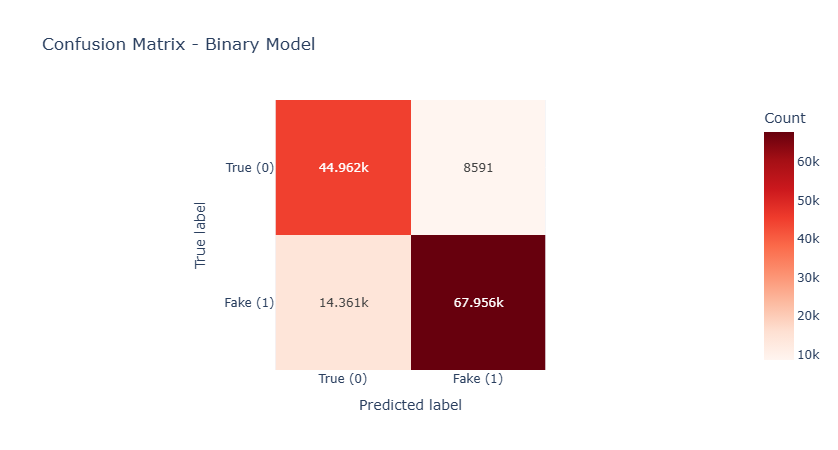
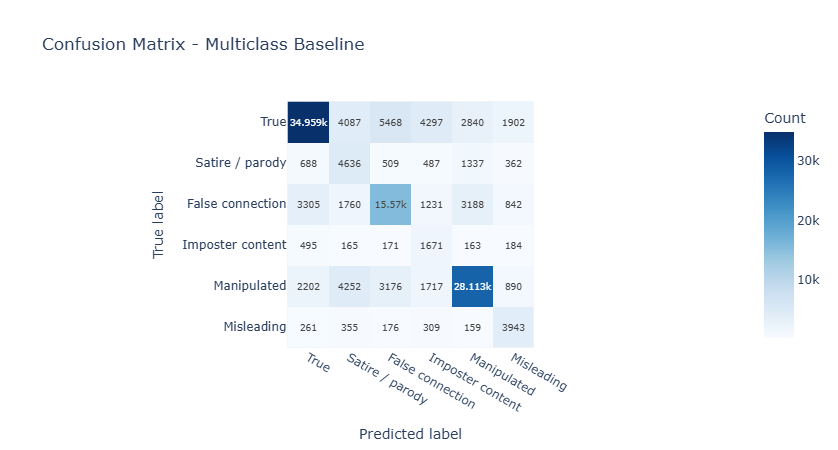
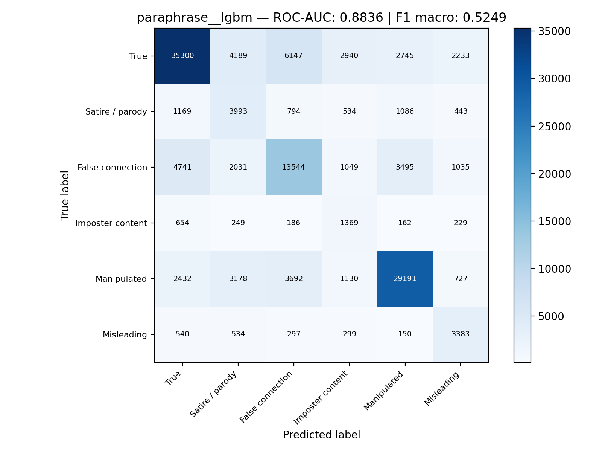
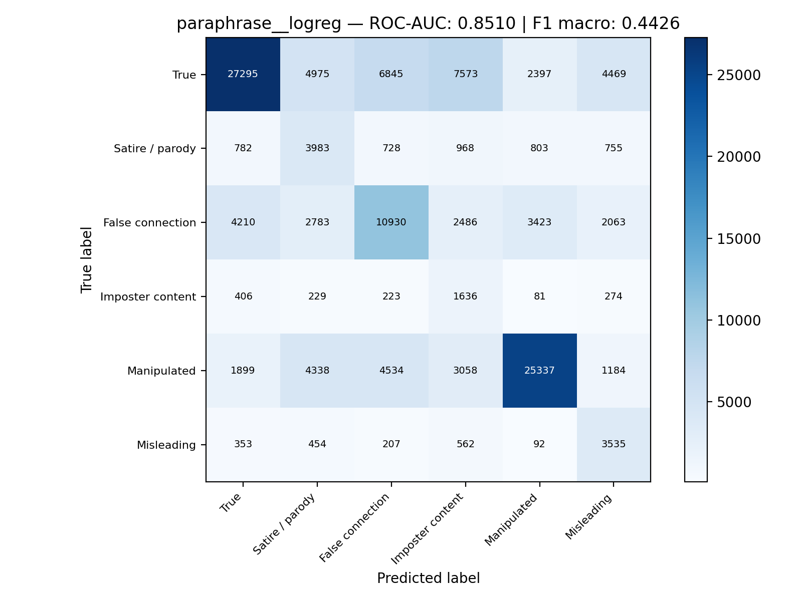
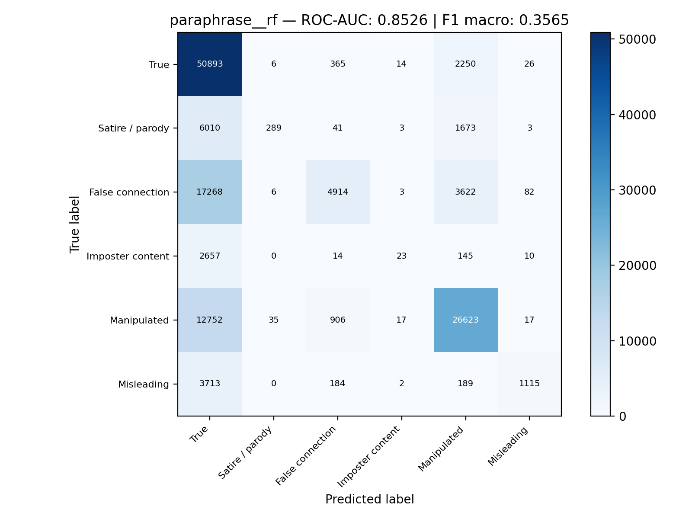
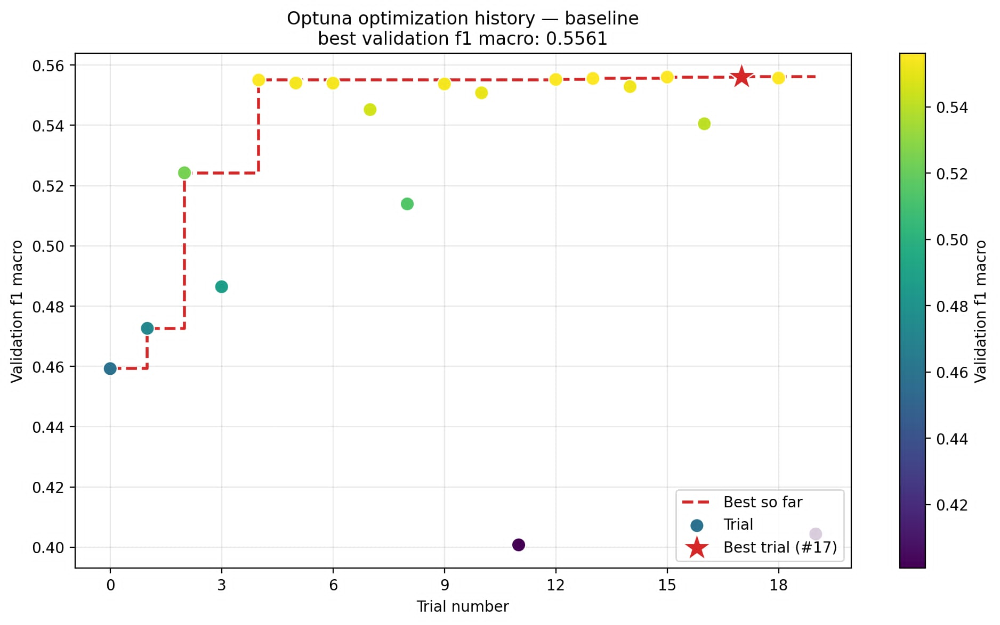
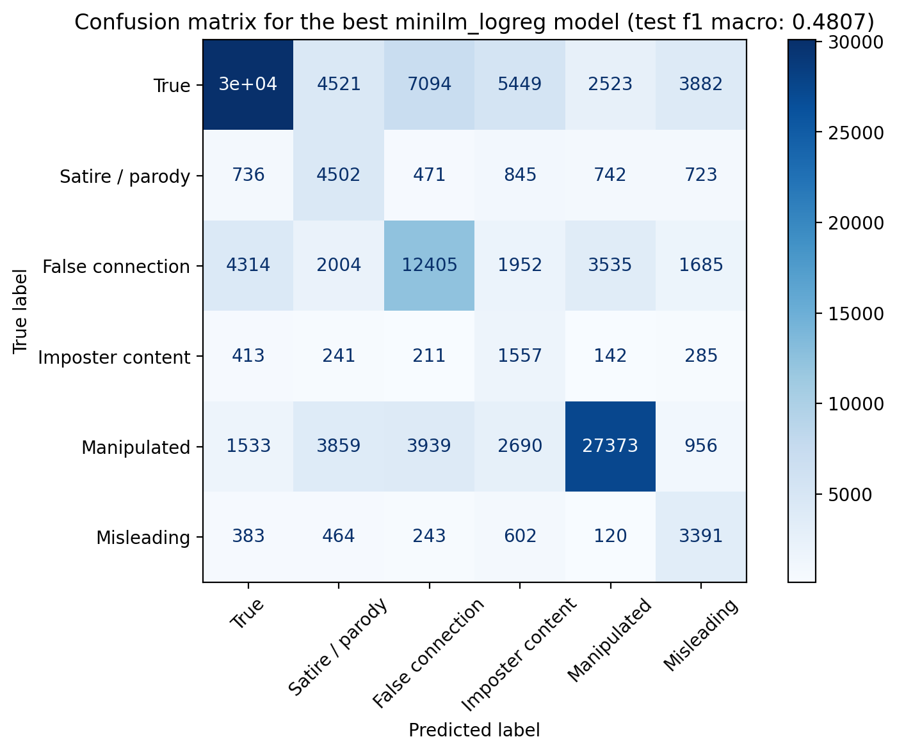
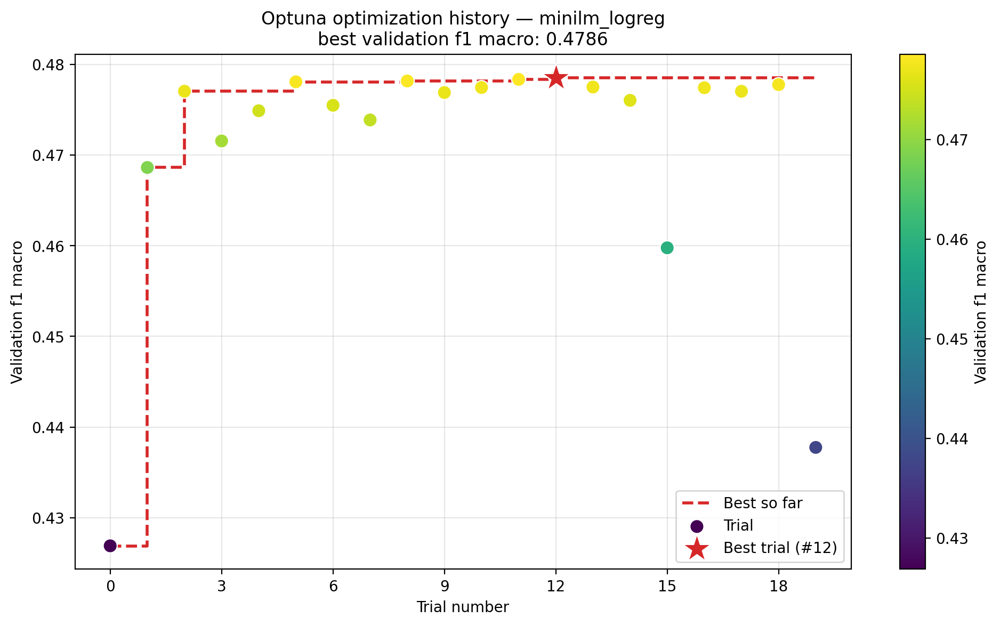
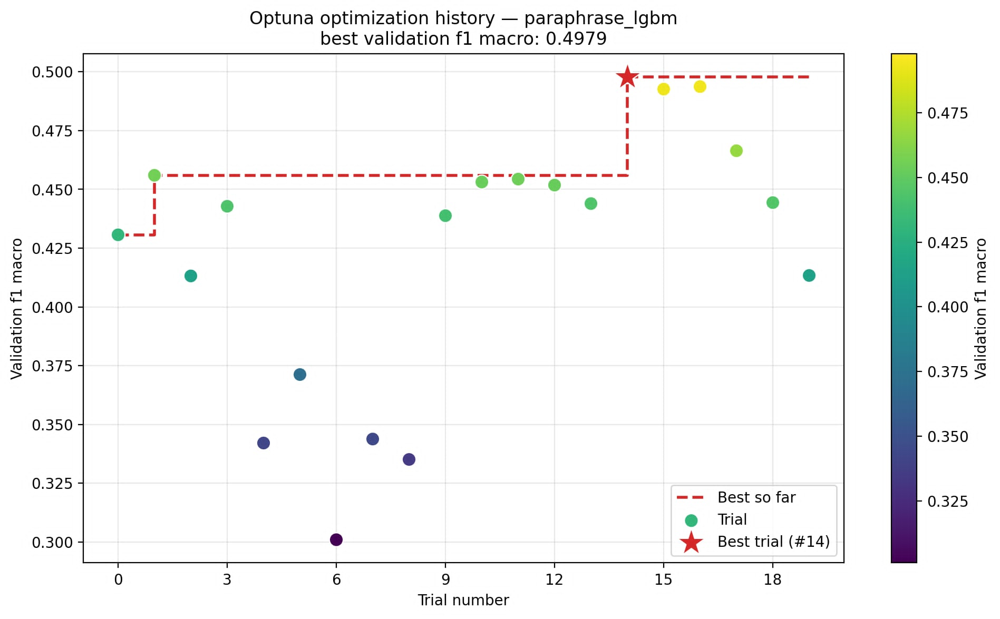

Wprowadzenie i podstawy teoretyczne

Pipeline & Workflow

Organizacja i stadie projektu

Cel i zadanie

Problemy i wyzwania

Hipotezy i oczekiwane wyniki

Eksploracja i czyszczenie - 1

Wyniki dla Baseline Model - 2

This will be a simple, text-only TF-IDF model based on unigrams and bigrams. Metadata and images (additional modalities in p=other words) will be ommited for this step of project advancement.

Class distribution (Training set - Binary):
shape: (2, 2)
┌──────────────┬────────────┐
│ binary_label ┆ proportion │
│ --- ┆ --- │
│ i32 ┆ f64 │
╞══════════════╪════════════╡
│ 0 ┆ 0.394146 │
│ 1 ┆ 0.605854 │
└──────────────┴────────────┘

ROC AUC (Binary): 0.9085

              precision    recall  f1-score   support

    True (0)     0.7579    0.8396    0.7967     53553
    Fake (1)     0.8878    0.8255    0.8555     82317

    accuracy                         0.8311    135870

macro avg 0.8228 0.8326 0.8261 135870
weighted avg 0.8366 0.8311 0.8323 135870

Top terms driving the binary predictions:
Words (True) Weight (True) Words (Fake) Weight (Fake)
Rank 1 says -7.938820 cutouts 12.210975
Rank 2 in -5.909153 circa 11.404288
Rank 3 police -5.793592 other discussions 9.430466
Rank 4 donates -5.554026 discussions 9.185211
Rank 5 sign -5.536510 mrw 8.778896
Rank 6 lets you -5.412850 colourized 7.391597
Rank 7 saves -5.373200 til 7.029614
Rank 8 way the -5.190966 florida man 6.314341
Rank 9 tells -5.183665 colorised 5.634219
Rank 10 these -5.029342 poster 5.588628

Train label distribution:
shape: (6, 2)
┌─────────────┬────────────┐
│ 6_way_label ┆ proportion │
│ --- ┆ --- │
│ i64 ┆ f64 │
╞═════════════╪════════════╡
│ 3 ┆ 0.020967 │
│ 4 ┆ 0.296979 │
│ 5 ┆ 0.038294 │
│ 1 ┆ 0.059016 │
│ 2 ┆ 0.190598 │
│ 0 ┆ 0.394146 │
└─────────────┴────────────┘
roc_auc=0.9003499705575603
precision recall f1-score support

           0     0.8341    0.6528    0.7324     53553
           1     0.3039    0.5781    0.3984      8019
           2     0.6211    0.6013    0.6110     25896
           3     0.1721    0.5865    0.2661      2849
           4     0.7853    0.6967    0.7384     40350
           5     0.4854    0.7578    0.5918      5203

    accuracy                         0.6542    135870

macro avg 0.5336 0.6455 0.5563 135870
weighted avg 0.7205 0.6542 0.6762 135870

Top terms driving the predictions for each class:
True Satire / parody False connection Imposter content Manipulated Misleading
Rank 1 says questions with circa mrw cutouts poster
Rank 2 this blog colourized til other discussions ussr
Rank 3 donates must see bc fwd discussions posters
Rank 4 jumping patriothole colorised florida man had to usa
Rank 5 uplifting news bce hmb obligatory soviet
Rank 6 rescued selftitled pareidolia ysk photoshop leaflet
Rank 7 lets you satire happy to montage imgur why
Rank 8 shaped quiz decolorized discussion swap cartoon
Rank 9 amid said what rfakehistoryporn florida woman available here wwii
Rank 10 my life happy ama first thing date unknown
Rank 11 these heartbreaking little guy homemade subtle modern
Rank 12 saves ftw has seen ocx cutout pamphlet
Rank 13 lawmaker rac donald trump oc thought of surprising
Rank 14 helps when this prepares lpt meanwhile reveals
Rank 15 way the titled happiest with fixed wwi
Rank 16 sign heartwarming auschwitz hmb while now with ww
Rank 17 yearold jurassic bark moments before in mr president reason
Rank 18 grew announced that hiroshima beer while as requested cuba
Rank 19 you can ep arm mr skeltal these days flyer
Rank 20 looks like revealed that surprised skeltal obvious bolshevism

Wyniki dla zaawansowanych modeli - 3

| name                    | roc_auc  | f1_macro | accuracy | precision_macro | recall_macro |
| ----------------------- | -------- | -------- | -------- | --------------- | ------------ |
| minilm-really\_\_lgbm   | 0.902646 | 0.565467 | 0.676536 | 0.540540        | 0.623457     |
| paraphrase\_\_lgbm      | 0.883598 | 0.524901 | 0.638699 | 0.503018        | 0.589049     |
| minilm-really\_\_logreg | 0.868183 | 0.479300 | 0.582314 | 0.469425        | 0.578797     |
| paraphrase\_\_logreg    | 0.851003 | 0.442613 | 0.535188 | 0.443552        | 0.551673     |
| minilm-really\_\_rf     | 0.873984 | 0.378978 | 0.638250 | 0.731601        | 0.364581     |
| paraphrase\_\_rf        | 0.852571 | 0.356497 | 0.617186 | 0.700508        | 0.343049     |

Wyniki dla Optuna - 4

The Baseline

Test f1 macro for the best baseline model: 0.5585

                  precision    recall  f1-score   support

            True     0.8376    0.6629    0.7401     53554

Satire / parody 0.2999 0.5649 0.3918 8019
False connection 0.6213 0.6083 0.6147 25895
Imposter content 0.1775 0.5542 0.2689 2849
Manipulated 0.7894 0.7057 0.7452 40350
Misleading 0.4860 0.7525 0.5906 5203

        accuracy                         0.6606    135870
       macro avg     0.5353    0.6414    0.5585    135870
    weighted avg     0.7230    0.6606    0.6815    135870

The paraphrase_logreg

Best validation f1 macro: 0.4403
Best params: {'c_param': 0.48430750886409346}
Test f1 macro for the best paraphrase_logreg model: 0.4426
precision recall f1-score support

            True     0.7774    0.5128    0.6180     53554

Satire / parody 0.2376 0.5036 0.3228 8019
False connection 0.4699 0.4151 0.4408 25895
Imposter content 0.1002 0.5707 0.1705 2849
Manipulated 0.7889 0.6317 0.7016 40350
Misleading 0.2870 0.6696 0.4018 5203

        accuracy                         0.5362    135870
       macro avg     0.4435    0.5506    0.4426    135870
    weighted avg     0.6574    0.5362    0.5740    135870

The minim_logreg

Test f1 macro for the best minilm_logreg model: 0.4807

                  precision    recall  f1-score   support

            True     0.8030    0.5618    0.6611     53554

Satire / parody 0.2888 0.5614 0.3814 8019
False connection 0.5092 0.4791 0.4937 25895
Imposter content 0.1189 0.5465 0.1953 2849
Manipulated 0.7949 0.6784 0.7320 40350
Misleading 0.3105 0.6517 0.4206 5203

        accuracy                         0.5837    135870
       macro avg     0.4709    0.5798    0.4807    135870
    weighted avg     0.6811    0.5837    0.6148    135870

The minim_lgbm (trzeba dopełnić)

The paraphrase_lgbm

    Test f1 macro for the best paraphrase_lgbm model: 0.5003

                      precision    recall  f1-score   support

                True     0.7878    0.6185    0.6930     53554
     Satire / parody     0.2669    0.4946    0.3467      8019
    False connection     0.5364    0.4934    0.5140     25895
    Imposter content     0.1505    0.5711    0.2382      2849
         Manipulated     0.7908    0.6932    0.7388     40350
          Misleading     0.3720    0.6416    0.4709      5203

            accuracy                         0.6094    135870
           macro avg     0.4841    0.5854    0.5003    135870
        weighted avg     0.6808    0.6094    0.6340    135870

Wyniki na neurosieci - 5

Opcja I
Accuracy: 0.8579723090665475
F1 macro: 0.7052591135901579
ROC-AUC macro OVR: 0.9582889336835315
precision recall f1-score support

            True     0.7490    0.8390    0.7915      2298

Satire / parody 0.9055 0.7462 0.8182 398
False connection 0.6803 0.6292 0.6538 1502
Imposter content 0.7273 0.1053 0.1839 76
Manipulated 0.9700 0.9700 0.9700 4528
Misleading 0.9048 0.7403 0.8143 154

        accuracy                         0.8580      8956
       macro avg     0.8228    0.6716    0.7053      8956
    weighted avg     0.8587    0.8580    0.8550      8956

Opcja II
Accuracy: 0.816569759793733
F1 macro: 0.7636669079566846
ROC-AUC macro OVR: 0.9485659820049199
precision recall f1-score support

            True     0.8304    0.8602    0.8451     19277

Satire / parody 0.9457 0.8883 0.9161 3410
False connection 0.7511 0.7474 0.7493 12776
Imposter content 0.5433 0.2040 0.2966 554
Manipulated 0.8703 0.8070 0.8374 715
Misleading 0.9465 0.9287 0.9375 1277

        accuracy                         0.8166     38009
       macro avg     0.8146    0.7393    0.7637     38009
    weighted avg     0.8146    0.8166    0.8142     38009
