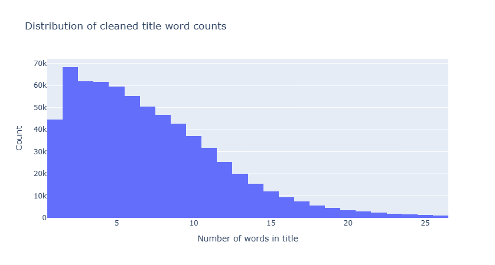
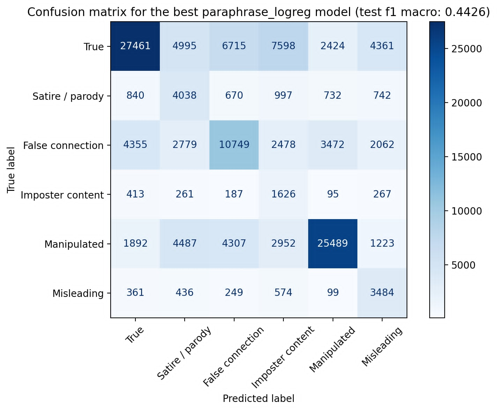
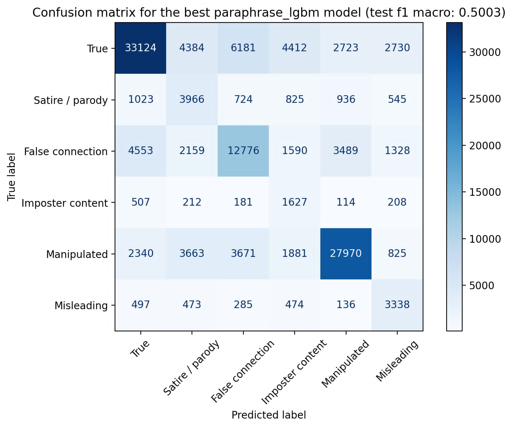
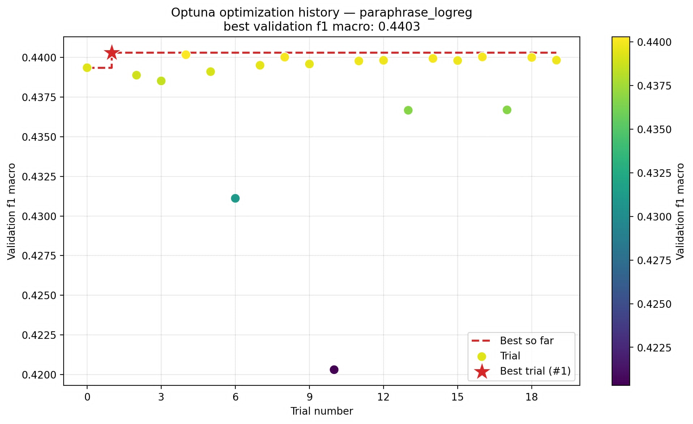

# Report of Fakeddit Data Analysis

## Introduction and motivation

The problem of fake news dissemination is acute in modern society, directly threatening citizens' trust in institutions and provoking irrational panic during critical moments such as medical epidemics. Combating this threat requires reliable machine learning algorithms, yet their development is seriously hindered by a shortage of high-quality data. Most traditional datasets, such as LIAR or Some-Like-It-Hoax, have very substantial limitations that make them largely unsuitable for comprehensive analysis. As a rule, they are too small in volume, restricted exclusively to text format and binary classification logic (where a news item can only be true or false), and focused on very narrow subject areas, such as American politics, which prevents models from learning from diverse everyday content.

### Dataset Charachtersitics

The uniqueness of the Fakeddit dataset lies in its multimodality, which allows algorithms to rely not only on isolated text but also on the visual context of images, significantly enriching the amount of information that can be used for the detection of misinformation. The data consists of post titles, images associated with them and additional metadata such as creation time, number of comments, subreddit name, etc. The authors of the original dataset carefully extracted not only the headlines and attached images but also rich metadata, including scores, author names, and audience comments.

The dataset consists of over 1 million posts, of which around 682k have an image associated with them. The posts come from across cleanest and most relevant 22 subreddits. The overall quality of the final general sample was good enough, no further pre-processing was required over the one provided by the dataset authors. During data collection there were also additional quality assurance steps, which can be reduced to all posts with score < 1, and subreddit-specific title tags removing in practice.

### Labels of The Posts

Labeling the vast amount of data was performed using the distant supervision method (an approach that involves automatically assigning labels to all posts based on the known general theme of the subreddit from which they were extracted). This eliminates the need to manually label each individual post. Thus, for each sample there are three different labels assigned, corresponding to different levels of granuality. We will describe it here vividly, but concisely:

- 2-way labels: a `True/False` split - represents whether or not the posts presents factual information
- 3-way labels: posts containing false data have been split into two categories:
  - false text, false sample - sample has `False` label in 2-way labeling and contains untrue information
  - true text, fale sample - sample has been deemed `False`, but contains "true" text - it involves only posts containing propaganda posters.
- 6-way labels: `True` label remains the same as in the other two kinds of labeling, the `False` label has been split into:
  - imposter content; i.e. content auto-generated by bots
  - misleading content: content conveyed in a manipulated way to mislead people in believing false narratives
  - satire / parody
  - false connection: submission images in this category do not accurately support their text descriptions
  - manipulated content: content that has been manually altered e.g. via image modifications

It should be noted that some of these categories, in particular Manipulated Content, consist almost entirely of visually altered pictures, so when creating narrowly focused models that analyse only textual data, it is advisable to disregard such labels so as not to introduce unnecessary mathematical noise into the training sample. The experiments from the original authors showed that combining text and images works much better than using just one, with the winning setup being BERT plus ResNet50 merged via max pooling. Error analysis revealed that models struggle the most with bot‑generated content and satire (which requires real‑world knowledge), while manipulated images are surprisingly easy to catchthough a bias toward the “True” label remains due to class imbalance.

For each subreddit the authors of chosen dataset they've inspected 10 random samples. If the 6-way label they assigned for each of the sample matched, so then the subreddit was kept in the dataset and the label was assigned to each post in the subreddit.This means the misinformation classification task turns into just predicting the subreddit based on the title alone.

A curious example is the label "manipulated" for the subreddit psbattle_artwork. That subreddit does contain image manipulation, but the posts there are mostly satirical in nature.

### Some Indicative Examples


Above is a picture of a cat titled "he looks huge". This post comes from `confusing_perspective` subreddit - thus it's labeled as false connection.


The above post is titled "Obligatory godzilla post" and comes from `psbattle_artwork` subreddit.


Cleaned title: "newspaper illustration depicting japan shooting china with the bullet of civilization first sinojapanese war"


Another propaganda poster "roosevelt figured wrong the tentacles of the dollaroctopus will be cut the jews in the white house and the gold in fort knox have been surrounded by young people by the armies of labor nsb poster from the netherlands"

## Proposed Pipeline & Workflow

To formalise our project, we need to describe the structure and order of data manipulations. The creators of the original Fakeddit were extremely concise in their assessments. Their publication contains almost no detailed steps or conventions for handling intermediate results. The final metrics are presented rather sparingly, which complicates direct analysis. Therefore, this project offers an alternative approach. It is not merely a technical replication but an attempt to deepen and conceptually rethink the conclusions of the benchmark authors. The main business task is to independently verify the results obtained by original authors. We strive to build alternative methods for constructing classifiers and to see whether these new, more modern approaches can surpass the original or provide serious competition in real world conditions. The implementation of our plan differs qualitatively from that proposed by the original due to strict objective constraints. The main challenge was the colossal size of the image database, exceeding 100 gigabytes. Operating with such multimedia arrays on basic computing resources is technically extremely difficult. However, despite of it, we deliberately decided to raise the complexity bar even more, abandoning the initially considered simplified version of the dataset containing only 55k items. We took instead a huge sample from the original dataset crafted on Kaggle, comprising about 700k records. An important consequence of this decision became a key feature of our pipeline. **The vast majority of analytical work is carried out exclusively on textual data**. Adding visual content became just and exclusively the final stage of our project.

Given the stated business goals and constraints, we built a strict sequence of dataset analysis consisting of five evolving stages. Each subsequent step logically follows from the limitations and problems of the previous one. The first stage involves exploratory data analysis (EDA) and data cleaning. Without this step, any metrics would be distorted by information noise, so obtaining a clean base of 700k items became the foundation for all further actions. In the second stage we create baseline models based on TF‑IDF. The business always needs a starting point, the simplest and fastest algorithm against which all expensive and complex solutions will be compared. However, the baseline relies on primitive word counting and completely ignores the semantics of language. Understanding this conceptual limitation naturally leads to the third stage: testing advanced ensemble models _in combination with modern language transformers_. Here we use embedders to extract deep meaning from texts and feed these complex data to algorithms such as LightGBM. When we find the most successful combination of model and embedder, the issue of tuning is being considered, beacause default algorithm settings do not alsways allow extracting maximum efficiency. So, in the next step the Optuna framework basically tune hyperparameters to the specific geometry of our analysed information. Finally, as we are awared, that text alone models cannot evaluated properly the situation with false connection or tricky text-picture interplay, the Vision‑Language Model was cosidered and used on the data.

Each stage of our pipeline is driven by a set of general assumptions (_or hypotheses_). First, we expect to **achieve results close to those obtained in the original study**, assuming that our overwhelming focus on textual data in the first four stages will not lead to a radical drop in metrics compared to the overall benchmark. Second, we test the hypothesis that **alternative modern text transformers will be able to demonstrate significantly better results**, even taking into account our computational constraints. We hope that the theoretical effectiveness of these complex tools will be unequivocally proven in practice, because otherwise the feasibility of their implementation in real business processes would be highly questionised. Finally, the original paper leaves some ambiguity regarding how critical the presence of images is for the claimed fine‑grained classification. Recognising the specificity of the Fakeddit dataset, we assume the some particular importance of visual content. Therefore, our final business hypothesis is that **the image‑based classification model will show a result at least comparable to the best purely text‑based model**, and ideally surpass it.

## Teoretical Fundamentals

Within our project, the processing of Fakeddit dataset could be understood as supervised learning task. We aim to build a model that uncovers hidden patterns and predicts one of six categories for new posts. From this perspective, it should be reminded, hat classification technique basically finds separating boundaries in a described feature space. Since we have six classes, we use multiclass strategies such as One‑vs‑Rest or native multiclass algorithms. Also before mere modelling, we perform Exploratory Data Analysis (EDA) using descriptive statistics and visualizations to detect class imbalance, text length distributions, and potential outliers. Strong imbalance would bias predictions toward the majority class. Data cleaning is critical to prevent data leakage problems, where test information accidentally enters training (e.g., duplicate posts). As a part of data cleaning, we remove rows with critical missing information rather than imputing them, considering the fact that synthetic values often distort semantic meaning to protect mathematical and semantic purity of the training sample.

To establish a meaningful benchmark, we begin with a simple and interpretable baseline: TF‑IDF vectorization combined with logistic regression. TF‑IDF converts text into a sparse numerical matrix by counting term frequencies and penalizing words that appear too often across the corpus, thereby highlighting truly distinctive terms. Logistic regression then takes these vectors, computes a weighted sum of features, and passes it through a sigmoid function to produce a probability of a post being fake. This baseline is mathematically transparent, fast, and allows us to directly inspect which words the model considers deceptive. But, linear models often fail to capture non‑linear patterns in language, so we turn to ensemble methods, specifically Random Forest and LightGBM. Random Forest builds many independent decision trees in parallel, reducing variance and overfitting. LightGBM, a gradient boosting algorithm, sequentially adds trees that correct the errors of previous ones by approximating the antigradient of the loss function. Its histogram‑based discretization and leaf‑wise tree growth (always splitting the leaf that gives the largest error reduction) make it exceptionally fast and accurate on large datasets.

It slould be said that fundamental limitation of TF‑IDF is that it ignores word order and context, treating each text as a mere bag of words. To capture semantic meaning, we use language embeddings from SentenceTransformers. These dense vectors encode entire sentences such that geometrically close vectors indicate semantically similar texts, even without shared vocabulary. We employ lightweight models like all‑MiniLM‑L12‑v2 and paraphrase‑MiniLM‑L3‑v2, which are products of knowledge distillation. They mimic large neural networks but have far fewer parameters, making them fast in some sense. The paraphrase family is particularly valuable for our project because it recognises hidden manipulation even when fake news authors rephrase known false narratives. After obtaining these semantic features, we need to ensure our classifiers perform at their best. Instead of relying on default hyperparameters, we use Optuna, a Bayesian optimization framework based on the TPE (Tree‑structured Parzen Estimator) algorithm. Optuna does not blindly search but mathematically analyses previous trials to select the most promising hyperparameter values. For our baseline, we tune the TF‑IDF parameters (max_df, min_df) and the logistic regression regularization strength. For LightGBM, we optimise the number of trees, learning rate, tree depth, and leaf count.

The final theoretical step in our project is the shift from text‑only to multimodal analysis, mainly because og the percantage of unsed visual contents before this stage. Thats why we try here modern Vision‑Language Models (VLMs), which go far beyond traditional convolutional networks by deeply integrating visual and textual perception. At their core are so-called Vision Transformers that split an image into small patches, convert them into numbers, and project them into the same hidden space as text tokens. Cross‑attention layers allow the model to compare written words with specific objects in the image. In practice we feed the model both an image and the post’s headline simultaneously, then extracting the last layer’s hidden states, applying an attention mask to filter padding, and average the results to obtain a single fused vector that combines the meaning of text and image in the end. This fused representation can be theoretically crucial because of the detection enabling of the most difficult category, False Connection, where a truthful text and a ambigious photo are deliberately paired to create a some type of compromised story.

## Step I. Introdactory EDA & Cleaning

### Data Loading & Environment

The practical implementation of our pipeline begins with loading and examining the raw dataset. Data acquisition was carried out along two parallel tracks: loading directly into the Kaggle cloud environment to ensure access to necessary computing resources, and local deployment of a subsample for rapid baseline testing.

To handle a dataset of this complexity efficiently, we deliberately abandoned Pandas in favor of **Polars**. Written in Rust, this module supports so-called _lazy evaluation_ and process parallelization. This provided even better loading and transformation speeds, which is very crucial issue within our kind of data processing.

### Temporal Resolution

The dataset covers a large time span, with the first posts dating back to 2008 and the most recent from 2019. The chronological distribution shows a steady increase in platform activity over the years, reaching its peak towards the end of 2019.


### Distribution and Data Leakage

Through our structural exploration, we identified 17 original columns, encompassing identifiers, platform metadata, media links, textual content, and three target variables.

The target variables shows a significant imbalance:

- 2-way classification: ~60% false posts vs. 40% truthful.


- 3-way classification: ~58% completely false, 40% truthful, and ~2% fake posts containing truthful text.


- 6-way classification: Truthful news (39%), visually manipulative content (30%), false connection (19%), satire (6%), misleading content (4%), and imposter content (~2%).


A critical discovery during the EDA stage was the rigid, almost 100% dependency between the fake category and the subreddit community it was posted in. If we had retained the subreddit column as a training feature, the algorithm would simply memorize the association between specific subreddits and labels rather than learning linguistic or visual patterns. To prevent this destructive data leakage, the subreddit column, along with author names and domains, was irrevocably removed from the pipeline.


### Provided and Syntesised Metadata

The dataset also provides rich platform metadata, including scores (upvotes minus downvotes), upvote ratios, and comment counts. As expected, user scores demonstrate an exponential decline: the median score is only 14 points, with only an extremely small fraction of posts going viral.


To cross-check the claims of the original dataset, we visualized the text length distribution. The vast majority of headlines contain between 2 and 10 words, after which the density drops sharply.
In there were some null values.



Using this metadata is tricky. For instance, there are almost 35,000 different authors, and most appear only once or twice, though a few clear outliers exist which could theoretically provide some signal. We also analyzed the matrix of missing values. Because metadata was deemed secondary to our primary semantic and multimodal analysis goals, there was no complex imputation strategy needed for these nulls; they were handled via our general cleaning steps.


### Data Cleaning & Deduplication

The final step of data preparation was deep cleaning. We applied an exact duplicate search by grouping the array by the unique combination of the cleaned title (clean_title) and image URL (image_url), keeping only the first unique occurrence. This eliminated information noise and prevented models from overfitting on repeated posts. Moreover, analyzing the missing values revealed over 201,000 gaps in the comment and score columns. We found that the vast majority of these anomalies strongly correlated with the subreddit psbattle_artwork, which has been removed from Reddit. We completely deleted all rows associated with this inactive community, ridding the dataset of a massive array of null values and removing content whose primary veracity can no longer be independently verified.

### Splitting the data

For the purpose of training, we split the data using a 60/20/20 stratified split. While a temporal split initially seemed justified, the labeling strategy used by the dataset authors means that time is not the main source of bias. For example, posts in the usnews subreddit are automatically assigned as truthful regardless of the date. Therefore, stratified splitting ensures that all classification models receive a proportionally representative sample of the complex 6-way labels.

## Step II. The Power and Unitily of Just-Text Models

For our initial experiments, we exclusively used the clean_title column. After the theoretical justification and preparation of a clean data sample, we move to the practical stage of building and evaluating our text-based classifiers.

### Baseline Model: TF-IDF & Logistic Regression

Creating a baseline model is a necessary first step; its metrics form the benchmark we will attempt to surpass using more complex architectures. Our pipeline combines a TF-IDF vectorizer (searching for uni- and bigrams with a limit of 30,000 features) and a Logistic Regression model with balanced class weights.

#### The Binary Case

First, we evaluated the model's performance on 2-way labels (truth versus falsehood) to gain a better intuition of how predictions are made. The algorithm has the potential to confidently separate the classes. To understand the internal logic of this binary classifier, we extracted the top 10 words with the highest predictive weights for each category:


Table: Classification metrics

| Class    | Precision | Recall | F1-score | Support |
| -------- | --------- | ------ | -------- | ------- |
| True (0) | 0.7579    | 0.8396 | 0.7967   | 53553   |
| Fake (1) | 0.8878    | 0.8255 | 0.8555   | 82317   |
| Accuracy |           |        | 0.8311   | 135870  |

Table : Top‑10 words/phrases for True and Fake classes

| Rank                     | True             | Fake                 |
| ------------------------ | ---------------- | -------------------- |
| 1                        | says             | cutouts              |
| 2                        | in               | circa                |
| 3                        | police           | other discussions    |
| 4                        | donates          | discussions          |
| 5                        | sign             | mrw                  |
| 6                        | lets you         | colourized           |
| 7                        | saves            | til                  |
| 8                        | way the          | florida man          |
| 9                        | tells            | colorised            |
| 10                       | these            | poster               |
| ROC AUC (Binary): 0.9085 | Accuracy: 0.8311 | Macro Avg F1: 0.8261 |

We see that model is biased towards the most common label (False). We get an interesting overview by the ranking of words that are the most impactful for the predictions. To get more context we took a look at the most common words for each subreddit then:


For truthful posts, the algorithm highlights markers typical of a dry news style (says, police, donates). In contrast, fake content is dominated by specific internet slang (mrw, til) and technical tags (cutouts, colourized). It is characteristic that the model relies not so much on the deep semantics of deception, but on explicit artifacts of the Reddit environment. Terms like circa or colorised heavily imply the fakehistoryporn subreddit, while cutouts points to psbattle_artwork. This confirms that term frequency provides indirect information about the subreddit, contributing to a form of data leakage.

#### 6-way case

We applied exactly the same sequence of actions to build the 6-class model. As expected, when moving to a finer classification, the absolute metric values noticeably decreased, though the probabilistic ROC-AUC metric remained at a stable, high level (0.9003).

The confusion matrix clearly demonstrates the reason for the drop in accuracy. While the True and Manipulated classes are predicted quite confidently, strong confusion arises among the remaining categories. The algorithm makes massive errors when distinguishing satire, imposter content, and misleading posts, often unfairly classifying them as truthful news. Logistic regression with TF-IDF works as a qualitative keyword filter, but it is incapable of understanding irony or contextual mismatches. The binary model is unconditionally superior in raw metrics, but it is too simplistic for real-world information analysis. The 6-class model represents a much more profound categorisation. Consequently, the performance of the 6-class baseline model establishes the main benchmark for our project.

In that case Optuna has also been used for hyperparameter optimization for 20 trials.

#### Table. The Baseline Model (already tunned by Optuna)

| Confusion Matrix                                    | Optuna training history                  |
| --------------------------------------------------- | ---------------------------------------- |
|  |  |

And the word rankings:

Here we have another finding; in the `misleading` category containing `propagandaposters` subreddit, "poster", "posters" and "ussr" are the words that influence the prediction the most.

### Semantic Embeddings

After creating the baseline model based on frequency analysis, we moved to the stage of extracting deep semantic meaning. To test whether modern neural network NLP technologies can recognize hidden manipulations better than keyword-based search algorithms, we introduced dense vector representations.

We selected two compact but powerful language transformers from the sentence_transformers library:

- all-MiniLM-L12-v2 (a universal model)

- paraphrase-MiniLM-L3-v2 (specialized in paraphrasing)


The choice was based on speed/performance trade-off. To isolate the influence of the embedder from the classification method, each was tested with default parameters across three algorithms: Logistic Regression (LR), Random Forest (RF), and LightGBM (LGBM).

#### Table: Model performance comparison

| Model                   | ROC AUC | F1 macro | Accuracy | Precision macro | Recall macro |
| ----------------------- | ------- | -------- | -------- | --------------- | ------------ |
| minilm-really\_\_lgbm   | 0.9026  | 0.5655   | 0.6765   | 0.5405          | 0.6235       |
| paraphrase\_\_lgbm      | 0.8836  | 0.5249   | 0.6387   | 0.5030          | 0.5890       |
| minilm-really\_\_logreg | 0.8682  | 0.4793   | 0.5823   | 0.4694          | 0.5788       |
| paraphrase\_\_logreg    | 0.8510  | 0.4426   | 0.5352   | 0.4436          | 0.5517       |
| minilm-really\_\_rf     | 0.8740  | 0.3790   | 0.6383   | 0.7316          | 0.3646       |
| paraphrase\_\_rf        | 0.8526  | 0.3565   | 0.6172   | 0.7005          | 0.3430       |

|                                 all-MiniLM-L12-v2                                 |                           paraphrase-MiniLM-L3-v2                            |
| :-------------------------------------------------------------------------------: | :--------------------------------------------------------------------------: |
|        **LightGBM**<br>         |        **LightGBM**<br>         |
| **Logistic Regression**<br> | **Logistic Regression**<br> |
|        **Random Forest**<br>        |        **Random Forest**<br>        |

The absolute leader of this stage was the minilm-really\_\_lgbm combination, which achieved an F1-macro of 0.5655, successfully beating our 6-way TF-IDF baseline.

Linear algorithms (LogReg) on dense vectors performed noticeably weaker than boosting, failing to separate non-linear semantic boundaries. The most paradoxical results came from the Random Forest algorithm: despite a good overall accuracy, its F1-macro catastrophically collapsed (0.35 - 0.37). A glance at the RF confusion matrices explains why: the algorithm completely capitulated to the dataset imbalance, aggressively predicting majority classes while outputting near zeros for satire and imposter content. Gradient boosting (LightGBM) indisputably proved its architectural superiority. Furthermore, the universal all-MiniLM-L12-v2 model consistently outperformed the paraphrase-specific model, suggesting that general semantic knowledge is more adaptable to Reddit's structure.

### Hyperparameter Tuning with Optuna

Afterwards, we've conducted 4 additional training runs with Optuna, both 20 trial long. For the objective function, we strictly utilized the F1-macro metric. We deliberately avoided using Accuracy or F1-weighted because, in the context of our dataset with extremely rare classes (e.g., Imposter content), those metrics can easily mask poor performance on minority categories. F1-macro equally accounts for successes in recognizing the dominant "True" category and failures in rare classes, making it the most demanding and honest evaluation criterion.

Below are confusion matrices for each of the approaches:

#### Table: Optuna. Confusion Matrices

|                                 paraphrase-MiniLM-L3-v2                                 |                                   all-MiniLM-L12-v2                                    |
| :-------------------------------------------------------------------------------------: | :------------------------------------------------------------------------------------: |
| **Logistic Regression**<br> | **Logistic Regression**<br> |
|      **LightGBM**<br>       |      **LightGBM**<br>       |

#### Table: Optuna. Training History

|                                  paraphrase-MiniLM-L3-v2                                  |                                    all-MiniLM-L12-v2                                     |
| :---------------------------------------------------------------------------------------: | :--------------------------------------------------------------------------------------: | --- |
| **Logistic Regression**<br> | **Logistic Regression**<br> |
|      **LightGBM**<br>       |      **LightGBM**<br>       |     |

The optimization history plots demonstrate that Optuna successfully narrowed the search spaces, discarding ineffective hyperparameter combinations and reaching mathematical optimums. Interestingly, after strict hyperparameter tuning, the optimized TF-IDF Baseline slightly overtook the tuned minilm_lgbm in F1-macro (0.5585 vs 0.5449). When comparing the confusion matrices of all tuned models, a consistent pattern emerges: absolutely all classifiers struggle to separate classes that have semantic overlap with truthful news. We observe a significant concentration of false negatives in the True category, indicating that models choose the path of least resistance under conditions of uncertainty.

#### Table: Tuned models performance comparison

| name              | accuracy  | macro precision | macro recall | macro f1  |
| ----------------- | --------- | --------------- | ------------ | --------- |
| baseline          | **0.658** | 0.534           | **0.641**    | **0.558** |
| paraphrase_logreg | 0.536     | 0.444           | 0.551        | 0.443     |
| paraphrase_lgbm   | 0.609     | **0.585**       | 0.585        | 0.500     |
| minilm_logreg     | 0.582     | 0.469           | 0.579        | 0.479     |
| minilm_lgbm       | **0.655** | 0.520           | 0.616        | 0.545     |

#### Tuned models ranked by F1‑macro

| Model                  | F1‑macro |
| ---------------------- | -------- |
| Baseline (TF‑IDF + LR) | 0.5585   |
| minilm_lgbm            | 0.5449   |
| paraphrase_lgbm        | 0.5003   |
| minilm_logreg          | 0.4807   |
| paraphrase_logreg      | 0.4426   |

The obtained results suggest that text vectorization methods have reached a plateau of effectiveness. Even after careful hyperparameter tuning and utilizing advanced transformers, the models exhibit consistent error patterns caused by the impossibility of completely separating satire or false connection from truthful headlines using purely linguistic means. This confirms the absolute necessity of moving to the final, multimodal stage of our analysis, where image data must be introduced to break this text-only barrier. Nonetheless we believe they could generalize better since they do not suffer from the same data leakage problem.

## Step III. The VLM (Vision-Language Model)

### Gathering images

Along the original dataset over 110GB of image data was shared by the authors.
This made it inpractical to work with in the cloud computing environments we depended on (kaggle and google colab).

Thus we've decided go along with fetching the images off of the internet by ourselves. We have used `image_url` column located for the each sample.

There were two great hinderences we've encountered:

- some images were no longer available
- rate limiting

nonetheless we've accepted that limitation and went further.
To save on storage space we've been continuously writing to a parquet file data in shape

```python
{
    id: str,
    image: bytes,
    clean_title: str,
    split: str,
    6_way_label: int,
}
```

where images were resized to 512x512 and stored as binary representation of a jpeg file.
This has saved us tons of storage. A file containing over 260k images took around 9.7GB of storage.

Evnetually storing all the images in this format would be a feasible future direction of the project.

### VLM-based model

To make use of visual data we have used `Qwen3-VL-Embedding-2B` model to extract embeddings off of both modalities.

```python
def embed_batch(clean_titles: list[str], image_bytes_list: list[bytes]) -> np.ndarray:
    """Returns float32 array of shape [batch_size, 2048]."""
    inputs = [
        {"text": title or "", "image": Image.open(BytesIO(img)).convert("RGB")}
        for title, img in zip(clean_titles, image_bytes_list)
    ]
    return model.encode(inputs, convert_to_numpy=True, batch_size=len(inputs))
```

These embeddings were then fed into LightGBM classification head. We've went with LightGBM as it seemed to score much better than logistic regression-based methods from the previous trials.


On the reduced dataset with `(image, clean_title)` pairs we have achieved:

- accuracy: 0.816
- macro F1: 0.764
- macro precision: 0.815
- macro recall: 0.739

which is much better result than for any of the previous approaches.
Visual data in fact did help.

## Implications and Future Directions

Our study is obviously not as powerful, high quality, or as credible as the original benchmark. However, it still offers introductory explanatory value for stakeholders. Moreover, it can serve as a solid foundation that would need only minor adjustments to become competitive with the original work.
For instance we propose some extra steps in a form of improcement in case of further analisys of Fakeddit Data:

1. Extend parquet dataset to contain all the images
2. Try different classification heads.
3. Use metadata such as scores, author names.
